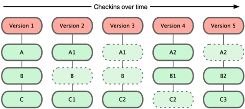

# 1. Overview

### Snapshots, Not Differences

    Git "nghĩ" về dữ liệu, xem dữ liệu giống như một tập hợp các "ảnh" (snapshot) của một hệ thống tập tin. 



### Nearly Every Operation Is Local

    Phần lớn các thao tác trên Git đều thực hiện được trên Local mà không cần kết nối internet.

### Git Has Integrity

    Mọi thứ trong Git đều được băm SHA-1 trước khi lưu trữ hoặc tham chiếu

### The Three States

- `committed`:  dữ liệu đã được lưu trữ một cách an toàn trong cơ sở dữ liệu
- `modified`: dữ liệu thay đổi nhưng chưa commit vào cơ sở dữ liệu
- `staged`: đánh dấu sẽ commit phiên bản hiện tại của một tập tin đã chỉnh sửa trong lần commit sắp tới
>Suy ra => 3 khu vực làm việc trong git
- `Git directory`: lưu trữ siêu dữ liệu và csdl cho dự án
- `Working tree`: bản sao một phiên bản của dự án
- `Staging area`: một tập tin chứa trong thư mục Git, nó chứa thông tin về những gì sẽ được commit trong lần commit sắp tới 


# 2. Basic

## 2.1 Repository
- Là một kho chứa toàn bộ project bao gồm source code và lịch sử thay đổi cũng như nội dung thay đổi của từng file và từng cá nhân đóng góp cho project đó.

- 2 loại: 
    - Remote repository: đặt trên server, share cho nhiều người
    - Local repository: đặt trên máy tính, chỉ dùng cho 1 người

- Init:
    - Tạo 1 repo trên máy, tạo folder và lệnh:
    
        ```git init```
    - Tạo một local repo từ remote repo:

        ```git clone repository_url```

## 2.2 File status lifecycle

    1 tập tin được chia làm 2 loại:

- `tracked`: đã được đánh dấu theo dõi trong Git để làm việc với nó, đã có mặt trong ảnh (snapshot) trước -> các trạng thái phụ khác là 
    - `unmodified`: chưa chỉnh sửa gì 
    - `modified`: đã chỉnh sửa
    - `staged`: đã sẵn sàng để commit 
- `untracked`: không có ở ảnh (lần commit) trước hoặc không ở trong staging area

Khi clone 1 repo, tất cả tập tin ở trạng thái tracked và unmodified, sửa file (modified) và stage chúng (staged), commit lên sẽ quay trở về unmodified, nếu xóa file sẽ thành untracked.


### Checking the Status of Files
`git status`

```
$ git status
On branch master
Your branch is up-to-date with 'origin/master'.
nothing to commit, working directory clean
```
-> Sạch, không có file đang theo dõi nào bị thay đổi
> Tạo 1 file mới tên `README `
-> Đang ở trạng thái untracked
### Tracking New Files
`git add <file_Name>`: add only

`git add .`: add all

```
$ git add README
$ git status
On branch master
Your branch is up-to-date with 'origin/master'.
Changes to be committed:
  (use "git reset HEAD <file>..." to unstage)

    new file:   README
```
-> Đang ở trạng thái staged 

### Ignoring Files
    Bỏ qua những file không cần thiết
    Tạo file với tên:  
`.gitignore`

### Viewing Your Staged and Unstaged Changes
- xem chính xác đã thay đổi nhưng chưa stage những gì: `git diff`
- xem những gì bạn đã mà chuẩn bị được commit: `git diff --staged`
- Commit: `git commit –m “Message”`
- Commit bỏ qua khu vực staging: `git commit –a –m “Message”`
- Xóa 1 file: `rm <file_name>`
- Di chuyển file: `mv file_from file_to`
- Xem lịch sử commit: `git log`

## 2.3. Undoing Things

- Thay đổi commit cuối cùng
`git commit --amend`
```
$ git commit -m 'initial commit'
$ git add forgotten_file
$ git commit --amend
```

- Loại bỏ tập tin staged
`git reset HEAD <file>`

- Phục hồi tập tin đã thay đổi
`git checkout -- <file>`

## 2.4. Working with remote
- Show remote: `git remote -v`
- Add remote: `git remote add [shortname] [url]`
- Fetch, kéo all dữ liệu từ remote về: `git fetch [remote-name]`
- Push: `git push origin master`
- Kiểm tra remote: `git remote show <remote>`
- Rename remote:  `git remote rename <from_name> <to_name>`
- Remove remote: `git remote remove <remotename>`

# 3. Branching

## 3.1. Overview
- Branch mặc định là master
- Branch mới được tạo ra sẽ chứa toàn bộ trạng thái và những thay đổi đã thực hiện trên project trước khi được tạo
- Với mỗi repository ta có thể tạo nhiều branch khác nhau và các nhánh này là độc lập với nhau nên khi ta có thay đổi đối với project trên branch này sẽ không ảnh hưởng đến các branch khác
- Khi tính năng được ta thử nghiệm trên nhánh mới hoàn thiện và đã được kiểm tra đầy đủ, ta có thể tiến hành hợp nhất (đưa những thay đổi của nhánh này gộp vào với nhánh khác) 2 nhánh với nhau bằng
- Có hai loại branch là local branch - là branch nằm trên máy tính của chúng ta và remote branch - là branch nằm trên máy chủ từ xa

- Tạo nhánh: `git branch <branch_name>`
- Chuyển nhánh: `git checkout <branch_name>`
- Tạo và chuyển: `git checkout -b <branch_name>` 
- Merg nhánh: 
```
$ git checkout master
$ git merge hotfix
```

## 3.2. Quản lý nhánh
- Liệt kê danh sách các nhánh: `git branch`
- Xem lần commit cuối từ mỗi nhánh:  `git branch –v`
- Xem các nhánh đã merged: `git branch --merged`
- Xem các nhánh chưa merge: `git branch --no-merged`
- Xóa 1 nhánh bất kỳ: `git branch –d <branch_name> `

## 3.3. Branching Workflows

### 1. Long-Running Branches
    Giữ tất cả các file và code chính thức sẽ release tại nhánh master, các nhánh khác – thường là dev / next sau khi test và hoàn thiện sẽ được ghép vào nhánh master. Các nhánh long-running tồn tại cùng thời gian sống của dự án.


    
### 2. Topic Branches
    1 vấn đề có thể được break ra nhiều giải pháp, và giải pháp tốt nhất sẽ được merge vào nhánh chính. Các nhánh topic là các nhánh short-live, có thể xóa bỏ khi hoàn thành topic.

## 3.4. Remote Branches

## 3.5. Rebasing


# 4. Server


