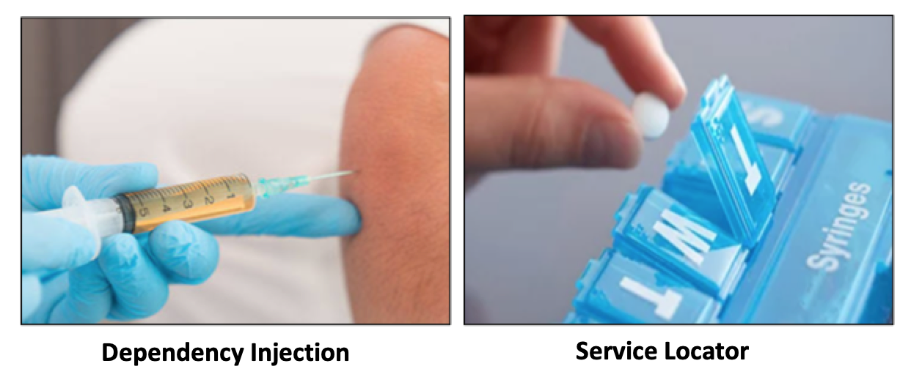
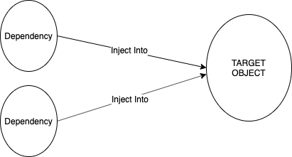
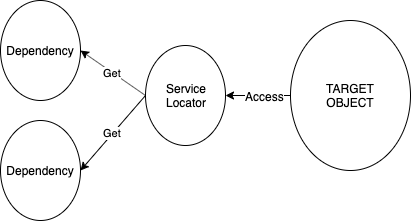

Ngày xưa khi vẫn còn mài ... trên trường có 1 người anh ném cho tôi vài keyword như thế này: SOLID, IoC, DI, Dagger các thứ. Và sau khi mò mẫm hỏi cụ google tôi như đả thông kinh mạch, tu thành chính quả với 2 từ "Không hiểu!". Và cho đến tận bây giờ kinh mạch của tôi vẫn thế! Sốc tập 1
    
Đến 1 ngày xưa khác, google cho ra lò ngôn ngữ Kotlin cùng framework Koin mà Gapo đang sử dụng, nôm na thì nó là thư viện để inject dependencies. Tôi như thuyền gặp gió ở giữa Hawai, bời vì nó impl DI nhẹ tênh. Xong rồi ông anh bên trên của tôi thấy tôi dùng Koin lại ném cho tôi 1 keyword là Service Locator gọi tắt là SL, ơ, "What the heck?". Mày mò thêm chút thì tôi biết được rằng 
    
    Koin là một Service Locator, không phải là Dependency Injector.

Thôi toang, tôi chợt nhận ra xài hoài mà có hiểu gì đâu! Sốc tập 2.

`Vậy DI và SL khác nhau cái gì mà đều giải quyết được bài toán IoC vậy?`

Sau khi bổ sung kinh mạch thì đại khái nó như thế này:
- Ông DI ông ý như kiểu bị covid, vừa vào bệnh viện phát là bị chích liền, vì bác sỹ biết ông ý cần tiêm cái gì, cũng chả cần ông ý nói gì bác sỹ gì cả. 
- Ông SL như kiểu ông ý vào nhà thuốc, bảo bác sỹ rằng tôi muốn thuốc này, thế là bác sỹ lấy thuốc trong tủ ra đưa cho ông ý.

## Dependency Injection

Các dependencies được cung cấp cho Target Object, mà không cần object làm bất cứ cái gì, nói cách khác dependency được `injected` vào target object

## Service Locator

Target Object truy cập các dependencies của nó từ một Locator(container, register...), giúp tìm kiếm các dependencies được yêu cầu và cung cấp nó cho target object. Nó không được `injected` nhưng được `located` thay thế.

## Vậy cái nào hơn?

So sánh 2 cái ảnh về DI và SL bên trên, ta có thể thấy bên SL:
- Target object k chỉ bị phụ thuộc vào dependencies mà còn bị phụ thuộc vào class Locator -> giải quyết vấn đề phụ thuộc mà lại còn làm tăng lên phụ thuộc 
- Target object không thể biết được mình cần dependencies nào đãn đến việc mock test khó khăn hơn

`Vậy nên chọn cái nào cho project bây giờ?`

Martin Fowler có 1 câu rằng: 

    “The choice between Service Locator and Dependency Injection is less important than the principle of separating service configuration from the use of services within an application.”

Tôi thấy nó đúng. 

## Liên hệ 
Project Android ở Gapo đang sử dụng Koin là SL:
- Hiện tại ở các class có không do framework quản lý, có thể inject qua constructor nhưng không inject lại đang dùng SL để lazy get dẫn đến việc khó mock, khó test, khó thay đổi sang 1 framework DI khác như dagger. 
- Thêm vào đó module graphs của Koin được xử lý ở runtime ảnh hưởng tới thời gian khởi động app. Toàn bộ dependencies được khởi tạo bằng kỹ thuật reflection khiến việc này tốn thời gian hơn. (https://blog.nimbledroid.com/2016/02/23/slow-Android-reflection.html)

## Kết luận
Chung quy lại, giữa DI và SL, dùng cái nào cũng được nhưng chúng ta phải hiểu và làm chủ được nó. Với các framwork về DI, có thể dùng hoặc không dùng nhưng nếu dùng hãy dùng 1 cách có hiểu biết!