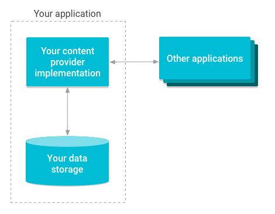
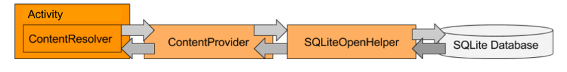
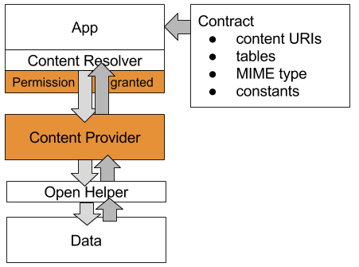

# ANDROID ADVANCE

# 1. Content Provider

## 1.1. Content Provider là gì?

Content provider là một thành phần để quản lý truy cập dữ liệu, nó cung cấp các phương thức khác nhau để các ứng dụng có thể truy cập dữ liệu từ một ứng dụng khác bằng cách sử dụng ContentResolver. Content Providers tách lớp ứng dụng khỏi lớp dữ liệu bằng cách trừu tượng nguồn dữ liệu cơ bản, do đó làm cho ứng dụng nguồn dữ liệu độc lập. Chúng cho phép kiểm soát permisstion, cho phép ứng dụng khác có quyền truy cập đến nguồn lưu trữ dữ liệu hay không, giúp cho việc chia sẻ dữ liệu trở lên dễ dàng. Và tất nhiên, bất kỳ ứng dụng nào có quyền (permissions) phù hợp đều có thể thêm, xóa, cập nhật và truy xuất dữ liệu của một ứng dụng khác bao gồm dữ liệu trong một số cơ sở dữ liệu Android Native.

Có 2 loại Content Providers:

- Native content providers: Chúng cung cấp quyền truy cập vào cơ sở dữ liệu tích hợp có sẵn, chẳng hạn như Contacts, Media player, Message và các cơ sở dữ liệu gốc khác. Bạn cần cấp các quyền cần thiết cho ứng dụng của mình trước khi sử dụng nhà cung cấp nội dung gốc
- Custom content providers: 1 dạng custom cở sở dữ liệu tự tạo bởi nhà phát triển để phù hợp với các yêu cầu của ứng dụng.

Vậy content Content Provider có thể coi là 1 nơi lưu trữ dữ liệu, cho phép các ứng dụng có thể chia sẻ, trao đổi dữ liệu cho nhau.

## 1.2.  Content Resolver là gì?

Để nhận dữ liệu và tương tác với Content Provider, một ứng dụng sử dụng đối tượng đó là Content Resolver để gửi yêu cầu tới Content Provider. Đối tượng ContentResolver cung cấp các phương thức query (), insert (), update () và delete () để truy cập dữ liệu từ Content Provider. Mỗi request bao gồm một URI và một truy vấn SQL, và response trả về sẽ là một đối tượng Cursor.




## 1.3. Example

Bài toán chúng ta bây giờ sẽ là: 

Tạo 1 ứng dụng (A) chỉ nhằm mục đích lưu trữ dữ liệu đa số các món ăn ngon, thông dụng và sử dụng nhiều nhất hiện nay. Ứng dụng này hoàn toàn không có giao diện. Chỉ là nơi lưu trữ dữ liệu. 

Tiếp theo đó là việc tạo ra 2 ứng dụng khác:
- 1 ứng dụng là từ điển các món ăn
- 1 ứng dụng sẽ là đặt món ăn của 1 nhà hàng.

Bài toán của chúng ta đơn giản chỉ là 2 ứng dụng trên sẽ cùng truy cập vào ứng dụng (A) lưu trữ dữ liệu để tìm kiếm dữ liệu có liên quan đến từng ứng dụng của mình.

## 1.4. Lợi ích Content Providers

Content Providers rất hữu ích cho các ứng dụng muốn cung cấp dữ liệu cho các ứng dụng khác.

- Với Content Providers, bạn có thể cho phép nhiều ứng dụng khác truy cập, sử dụng và sửa đổi một nguồn dữ liệu duy nhất mà ứng dụng của bạn cung cấp. 
- Để kiểm soát truy cập, bạn có thể chỉ định các permisions cho Content Providers của mình, chỉ định cách các ứng dụng khác có thể truy cập dữ liệu. Ví dụ: Nhà hàng có thể không được phép thay đổi dữ liệu thông tin món ăn mà không phải do họ cung cấp.
- Bạn có thể lưu trữ dữ liệu độc lập với ứng dụng, bởi vì Content Providers nằm giữa giao diện người dùng và nơi dữ liệu của bạn được lưu trữ. Bạn có thể thay đổi cách dữ liệu được lưu trữ mà không cần thay code chương trình.
- Một lợi ích khác của việc tách dữ liệu khỏi giao diện người dùng với Content Providers là các nhóm phát triển có thể hoạt động độc lập trên giao diện người dùng và kho dữ liệu của ứng dụng của bạn. Đối với các ứng dụng phức tạp, lớn hơn, rất phổ biến là giao diện người dùng và phần phụ trợ dữ liệu được phát triển bởi các nhóm khác nhau và thậm chí chúng có thể là các ứng dụng riêng biệt.

## 1.5. Kiến trúc Content Providers



### Data and Open Helper

Là nơi cung cấp dữ liệu: SQLite (hoặc Room), Realm, remote data,...

### Contract

Contract là một lớp public hiển thị thông tin quan trọng về Content Providers cho các ứng dụng khác. Điều này thường bao gồm các lược đồ URI, các hằng số quan trọng và cấu trúc của dữ liệu sẽ được trả về. Ví dụ: đối với ứng dụng từ điển món ăn, Contract có thể hiển thị tên của các cột chứa giá và tên của sản phẩm và URI để truy xuất một món ăn theo tên hoặc ID.

###  Content Provider

Ví dụ: để lấy thông tin món ăn từ cơ sở dữ liệu của ứng dụng, ứng dụng từ điển sẽ kết nối với ContentProvider chứ không phải trực tiếp đến cơ sở dữ liệu vì điều đó không được phép.

Ứng dụng sở hữu dữ liệu chỉ định những quyền nào (permissions) các ứng dụng khác cần phải làm việc với nhà cung cấp nội dung. Ví dụ: nếu bạn có ứng dụng cung cấp thông tin các món lẩu cho nhà hàng kinh doanh, ứng dụng của bạn sở hữu dữ liệu và xác định quyền truy cập của các ứng dụng khác đối với dữ liệu. Quyền được chỉ định trong file Android Manifest.

### Content Resolver

Content Providers luôn được truy cập thông qua trình Content Resolver. Hãy nghĩ về Content Resolver như một lớp trợ giúp quản lý tất cả các chi tiết kết nối với một Content Provider cho bạn. Phản ánh API của Content Provider, đối tượng ContentResolver cung cấp cho bạn các phương thức query (), insert (), update () và delete () để truy cập dữ liệu của Content Provider. Ví dụ: để có được tất cả các món ăn là lẩu, ứng dụng từ điển món ăn sẽ tạo truy vấn cho món lẩu và sử dụng trình Content Resolver để gửi truy vấn đó đến Content Providers.

## 1.6. Implementing

- Data (dữ liệu) trong cơ sở dữ liệu
- Một phương thức để truy cập lưu trữ dữ liệu, ví dụ, thông qua một trình trợ giúp ( open helper) cho một cơ sở dữ liệu.
- Định nghĩa, khai báo Content Provider của bạn trong Tệp Android Manifest để cung cấp cho ứng dụng của riêng bạn và các ứng dụng khác.
- Phân lớp (kế thừa) lớp ContentProvider thực hiện các phương thức query (), insert (), delete (), update (), count () và getType ().
- Public contract class hiển thị lược đồ URI, tên bảng, loại MIME và các hằng số quan trọng cho các lớp và ứng dụng khác. Trong khi điều này là không bắt buộc, nhưng nếu không có nó, các ứng dụng khác không thể biết cách truy cập vào Content Provider của bạn.
- Trình Content Resolver để truy cập vào Content Provider bằng các phương thức và truy vấn thích hợp.

Các phương thức cần được Override trong lớp Content Provider:

- `onCreate()`: Phương thức này được gọi khi Provider được bắt đầu, nếu quá trình khởi tạo thành công trả về true, ngược lại là false
- `query()`: Phương thức nhận yêu cầu từ Client. Kết quả được trả về như một đối tượng Cursor.
- `insert()`: Phương thức chèn một dòng dữ liệu mới vào Content Provider.
- `delete()`: Phương thức xóa một dòng dữ liệu đã tồn tại.
- `update()`: Phương thức cập nhật một dòng dữ liệu nào đó đã tồn tại.
- `getType()`: Phương thức trả về kiểu MIME của dữ liệu tại các URI.


# 2. Broadcast Recieiver

    Tại sao khi vừa bật 4G hoặc Wifi lên thì facebook nó bắt đầu gửi một đống thông báo xuống chỗ notifycation? Chính xác là nó dùng Broadcast Receiver để làm đó các bạn trẻ :D

## 2.1. Broadcast Recieiver là gì?
- Broadcast Receiver là một trong 4 component lớn trong Android, với mục đích là lắng nghe các sự kiện, trạng thái của hệ thống phát ra thông qua Intent nhờ đó mà các lập trình viên có thể xử lí được các sự kiện hệ thống ở bên trong ứng dụng của mình.

- Broadcast Receiver có thể hoạt động được cả khi ứng dụng bị tắt đi, nghĩa là ở background chính vì vậy nó thường được sử dụng với service.

## 2.2. Khi nào thì sử dụng Broadcast Receiver

Đó là ứng dụng cần xử lí một công việc nào đó mà phải phuộc thuộc vào hệ thống, chỉ khi hệ thông phát ra một sự kiện, hành động nào đó thì công việc này mới được thực hiện.Những trường hợp được ứng dụng nhiều nhất khi sử dụng Broadcast Receiver đó là : lắng nghe sự kiện thay đổi mạng, lắng nghe sự kiện pin yếu, lăng nghe tin nhắn, cuộc gọi đến…

Một công dụng tuyệt vời nữa đó là dùng để start Service của ứng dụng trong Broadcast Receiver.

## 2.3. Cách đăng ký Broadcast Receiver

### a. Đăng ký trong file AndroidManifest
Là cách chúng ta khai báo Broadcast Receiver trong Manifest và khi lần đầu khởi chạy ứng dụng thì nó sẽ đăng ký Broadcast và cứ thế nó start cho đến khi các bạn XOÁ ứng dụng đi.Nó vẫn lắng nghe khi các bạn đã tắt ứng dụng đi luôn nhé đây là ưu điểm của cách đăng ký này.
```xml
<application
    ...

    <receiver android:name=".Broadcast">
        <intent-filter>
            <action android:name="android.intent.action.AIRPLANE_MODE"/>
        </intent-filter>
    </receiver>
</application>
```
trong thẻ <intent-filter> có sự kiện lắng nghe là <action android:name="android.intent.action.AIRPLANE_MODE"/> tương ứng với sự kiện bật tắt chế độ máy bay. Nếu không có action này thì chúng ta sẽ không nhận được bất kì thông báo nào khi có sự thay đổi. Ở trên chúng ta đã thực hiện đăng ký lắng nghe bây giờ chúng ta sẽ xử lý kết quả trả về bằng cách tạo một class mới extends lại BroadcastReceiver, override lại hàm onReceive() và khi có sự thay đổi thì sẽ đi vào hàm này/

```java
public class Broadcast extends BroadcastReceiver {
    @Override
    public void onReceive(Context context, Intent intent) {
        Log.d(Broadcast.class.getSimpleName(), "Air Plane mode");
    }
}
```

### b. Đăng ký trong file Java
Đây là cách thông dụng nhất vì đa số trong các ứng dụng chúng ta chỉ lắng nghe trong phạm vi ứng dụng của mình, khi kết thúc thì chúng ta cũng ngừng lắng nghe luôn. Chúng ta cũng làm như ở cách đăng ký ở trong file Manifest chỉ khác biệt ở trong cách đăng ký.

```java
public class MainActivity extends AppCompatActivity {

    private Broadcast broadcast;

    @Override
    protected void onCreate(Bundle savedInstanceState) {
        super.onCreate(savedInstanceState);
        setContentView(R.layout.activity_main);
        broadcast = new Broadcast(); // khởi tạo broadcast
        IntentFilter filter = new IntentFilter("android.intent.action.AIRPLANE_MODE"); // khởi tạo IntentFilter để đăng ký lắng nghe hành động bật tắt chế độ máy bay
        registerReceiver(broadcast, filter); //đăng kí lắng nghe
    }

    @Override
    protected void onStop() {
        super.onStop();
        unregisterReceiver(broadcast); // bỏ lắng nghe nếu k sẽ lỗi `Are you missing a call to unregisterReceiver()?`
    }
}
```
## 2.4. Custom BroadcastReceiver

Thường được sử dụng để truyền thông điệp trong và ngoài ứng dụng nhưng không phải là sự thay đổi từ hệ thống mà là những thông điệp mà lập trình viên muốn truyền đi.

Chúng ta tạo receiver nhưng ở phần action thay vì sử dụng action có sẵn của hệ thống thì chúng ta tự tạo 1 action

```xml
<application

    <receiver android:name=".Broadcast">
        <intent-filter>
            <action android:name="test.broad.cast"/>
        </intent-filter>
    </receiver>
</application>
```
Điểm khác biệt ở đây là có thêm vào đoạn code để có thể gửi được Broadcast. Mình thực hiện send Broadcast từ màn hình MainActivity vào tạo thêm một activity để nhận kết quả trả về. 

```java 
public class MainActivity extends AppCompatActivity {

    @Override
    protected void onCreate(Bundle savedInstanceState) {
        super.onCreate(savedInstanceState);
        setContentView(R.layout.activity_main);
        Intent intent = new Intent();
        intent.setAction("test.broad.cast");
        sendBroadcast(intent);
    }
}

Ở Activity nhận kết quả trả về mình đăng ký nhận và hủy Broadcast và cũng sử dụng lại class Broadcast ở trên.

```java
public class TestBroadcastActivity extends AppCompatActivity {

    private Broadcast mBroadcast;

    @Override
    protected void onCreate(Bundle savedInstanceState) {
        super.onCreate(savedInstanceState);
        setContentView(R.layout.activity_test_broadcast);
        mBroadcast = new Broadcast();
        IntentFilter filter = new IntentFilter("test.broad.cast");
        registerReceiver(mBroadcast, filter);
    }

    @Override
    protected void onStop() {
        super.onStop();
        unregisterReceiver(mBroadcast);
    }
}

```

Ta thấy từ cách sendBroadcast trên chúng ta có thể áp dụng để truyền dữ liệu giữa các class với nhau. Ở đây mình sẽ làm một ví dụ gửi nhận một chuỗi String và Log ra. Mình làm tương tự như trên nhưng thêm dòng code sau để gửi dữ liệu

`intent.putExtra("string_test", "Hello");`

Và ở bên class Broadcast - nơi mà chúng ta nhận và xử lí dữ liệu thì chúng ta sử dụng dòng code

`intent.getStringExtra("string_test")`

Đây là 1 đoạn code ngắn gọn với kotlin: 

```kotlin
val filter = IntentFilter("test.broad.cast")
registerReceiver(object:BroadcastReceiver() {
  fun onReceive(context:Context, intent:Intent) {
    val results = getResultExtras(true)
    val hierarchy = results.getString("hierarchy")
    results.putString("hierarchy", hierarchy + "->" + TAG)
    Log.d(TAG, "Anonymous class broadcast receiver")
  }
}, filter)

val intent = Intent("test.broad.cast")
sendOrderedBroadcast(intent, null, object:BroadcastReceiver() {
  fun onReceive(context:Context, intent:Intent) {
    val results = getResultExtras(true)
    val hierarchy = results.getString("hierarchy")
    println(hierarchy)
    Log.d(TAG, "Final Receiver")
  }
}, null, Activity.RESULT_OK, null, null)
```
## 2.5. Local BroadcastManager – Gửi Broadcast trong nội bộ ứng dụng

Như các bạn đã biết thì khi gửi Broadcast thì bất kì ứng dụng nào đăng kí đều nhận được. Đôi khi vì lý do bảo mật cho ứng dụng mà chúng ta không muốn bất kì ứng dụng nào khác nhận được. Những thông tin này chỉ được gửi bên trong ứng dụng.

Sự khác biệt ở đây ở trong cách mà chúng ta sendBroadcast, register và unRegister

Với sendBroadcast

>LocalBroadcastManager.getInstance(this).sendBroadcast(intent);

Với RegisterBroadcast

>LocalBroadcastManager.getInstance(this).registerReceiver(mBroadcast, filter);

Và với UnRegisterBroadcast

>LocalBroadcastManager.getInstance(this).unregisterReceiver(mBroadcast);

ví dụ:
```kotlin
LocalBroadcastManager.getInstance(this).registerReceiver(object:BroadcastReceiver() {
  fun onReceive(context:Context, intent:Intent) {
    val message = intent.getStringExtra("foo")
    Log.d("LocalBroadcastManager", "foo : " + message)
  }
}, IntentFilter("my-custom-event"))
```
## 2.6. Hạn chế Broadcast với permission
Khi chúng ta sử dụng cách này thì chỉ những nơi đã được cấp quyền phù hợp với bên gửi thì mới có thể nhận được Broadcast.

Với bên gửi

Khi mà bạn gọi  sendBroadcast(Intent, String) hoặc sendOrderedBroadcast(Intent, String, BroadcastReceiver, Handler, int, String, Bundle) bạn có thể hạn chế quyền trong tham số bằng cách

>sendBroadcast(intent, Manifest.permission.RECEIVE_SMS);

Với bên nhận

Nếu chúng ta muốn nhận được Broadcast ở trên thì chúng ta phải làm theo những cách sau:

>registerReceiver(mBroadcast, filter, Manifest.permission.RECEIVE_SMS, null);

Hoặc đăng ký trong file Manifest
```xml
 <receiver android:name=".Broadcast"
     android:permission="android.permission.SEND_SMS">
        <intent-filter>
           <action android:name="android.intent.action.AIRPLANE_MODE"/>
        </intent-filter>
 </receiver>
```

## 2.7 Độ ưu tiên giữa các Broadcast Receivers

- Được sắp xếp với một thứ tự xác định bằng cách sử dụng sendOrderedBroadcast (Intent, String, BroadcastReceiver, Handler, int, String, Bundle) và thuộc tính android:priority
- Mặc định của priority là 0
- Chỉ một đối tượng nhận được trong một thời điểm
- Sau khi đối tượng thứ nhất nhận xong thì đối tượng thứ hai nhận hoặc chúng ta có thể hủy bỏ luôn quá trình với abortBroadcast()
- Priority là một số Integer và càng lớn thì độ ưu tiên càng cao.

```xml
<receiver android:name=".Broadcast"
     android:permission="android.permission.SEND_SMS">
        <intent-filter
            android:priority="1">
            action android:name="android.intent.action.AIRPLANE_MODE"/>
        </intent-filter>
</receiver>
```

## 2.8. Sử dụng Package Manager để Disable các Broadcast tĩnh
Khi ta có hai class kế thừa lại BroadcastReceiver tương ứng với hai đối tượng lắng nghe Broadcast thì nếu ta muốn disable Broadcast thứ hai tương ứng với class Broadcast2.class thì ta làm như sau:
```java
private void disableBroadcast(Context context) {
    ComponentName receiver = new ComponentName(context, Broadcast2.class);
    PackageManager pm = context.getPackageManager();

    pm.setComponentEnabledSetting(receiver,
            PackageManager.COMPONENT_ENABLED_STATE_DISABLED,
            PackageManager.DONT_KILL_APP);
}
```

## 2.9. Note

1. Nếu bạn không muốn sendBroadcast cho các đối tượng ở bên ngoài ứng dụng của bạn thì bạn có thể sử dụng LocalBroadcast vì LocalBroadcastManager hiệu quả hơn nhiều (không cần giao tiếp liên tục) và cho phép bạn tránh suy nghĩ về bất kỳ vấn đề bảo mật nào liên quan đến các ứng dụng khác có thể nhận hoặc gửi các broadcast của bạn.

2. Không phát thông tin nhạy cảm bằng cách sử dụng intent không tường minh. Thông tin có thể được đọc bởi bất kỳ ứng dụng nào đăng ký để nhận broadcast. Có ba cách để kiểm soát ai có thể nhận broadcast của bạn:

    - Bạn có thể set các quyền cho Broadcast
    - Set package mà bạn muốn gửi Broadcast đến quá setPackage(String)
    - Sử dụng Local Broadcast

3. Khi bạn đăng ký nhận Broadcast thì bất cứ ứng dụng nào mà bạn đăng ký đều có thể gửi những thông tin độc hại đến ứng dụng của bạn. Có các cách phòng tránh sau đây:
    - Set các quyền bạn cho là "Nguy hiểm"
    - Bạn có thể set android:exported=false
    - Local Broadcast
4. Chú ý cách đặt tên hành động lắng nghe sao cho tránh trùng lặp tên
5. Không nên chạy task nặng trong hàm onReceive() nếu bạn muốn chạy thì chúng ta nên sử dụng một trong hai cách sau:
    - Sử dụng goAsync() trong onReceive()
    - Sử dụng JobScheduler
6. Không nên start Activity từ Broadcast vì lúc này trải nghiệm người dùng đang chập chờn, nhất là khi có nhiều hơn một người nhận. Thay vào đó hãy xem xét hiện thị các thông báo.

>Nguồn [1](https://viblo.asia/p/tim-hieu-ve-broadcast-receiver-trong-android-aWj53O4w56m)
[2](https://vntalking.com/broadcast-receivers-trong-android.html#2-tao-mot-class-broadcast-receiver-trong-android)

# 3. Service

    Khi bạn tắt ứng dụng messenger đi rồi mà có người khác gửi tin nhắn đến, thì nó vẫn show lên một notify thông báo cho bạn. Đù có cái gì chạy ngầm rồi kể cả khi mh tắt app. Yes, nó là service.

## 3.1. Service là gì?

Một Service là một thành phần (component) có thể thực hiện các hoạt động lâu dài trong background và nó không cung cấp một giao diện người dùng. Một thành phần khác của ứng dụng có thể start nó, và nó tiếp tục chạy trong background ngay cả khi người dùng chuyển sang ứng dụng khác.

