# ANDROID BASIC

# 1. Activity

## 1.1 Lifecycle


- `onCreate()`: khởi tạo layout
- `onStart()`: layout hiện
- `onResume()`: tương tác 
- `onPause()`: bị che 1 phần bởi app khác
- `onStop()`: bị che hoàn toàn
- `onDestroy()`: die
- `onRestart()`: tái khởi động sau khi stop
- `onSaveInstanceState()`: lưu app state
- `onRestoreInstanceState()`: khôi phục app state

## 1.2 Scenarios of Lifecycle
- **Scenario 1: App is finished and restarted**
    - User ấn back hoặc
    - Activity.finish() được gọi

    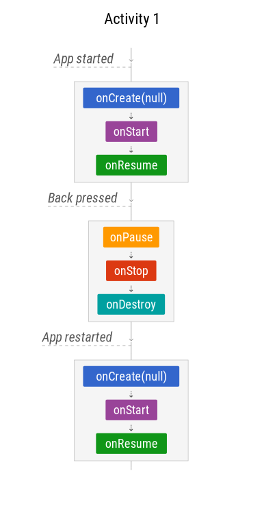

- **Scenario 2: User điều hướng**
    - User ấn Home
    - User switches sang app khác(từ menu đa nhiệm, thông báo, chấp nhận cuộc gọi,...)

    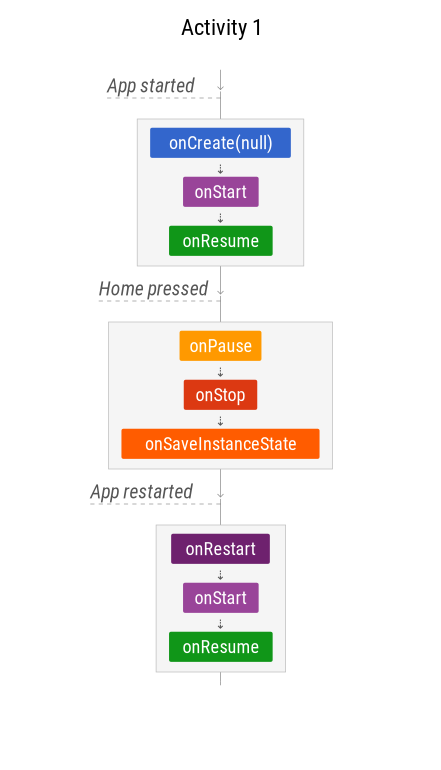

    Khi activity stop, system sử dụng `onSaveInstanceState()` để lưu app state trong TH system kill process của app sau này, nếu không kill, activity instance sẽ được lưu vào RAM và khi activity comes back nó được gọi lại mà k cần khởi tạo lại các thành phần đã khởi tạo

- **Scenario 3: Configuration changes**
    - Configuration thay đổi, như xoay màn hình
    - User resize màn hình trong chế độ đa màn hình

    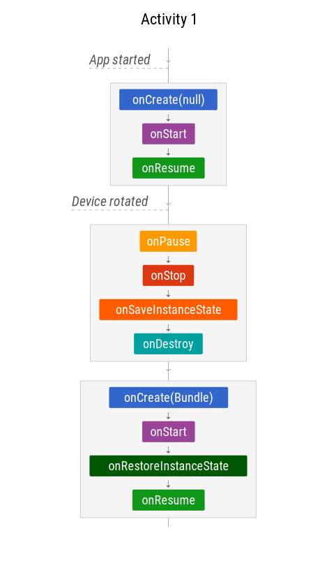

    Activity hoàn toàn bị hủy (destroyed), nhưng trạng thái được lưu và khôi phục cho instance mới<br/>
    Bundle trong onCreate and onRestoreInstanceState giống nhau

- **Scenario 4: App bị tạm dừng bởi system**
    - Bật Multi-window mode (API 24+) and mất focus
    - 1 phần app khác che (cover) app đang chạy(1 dialog mua hàng, 1 dialog xin quyền, hộp thoại đăng nhập bên thứ 3, 1 cuộc gọi tới...)
    - 1 intent chooser xuất hiện, như share dialog

    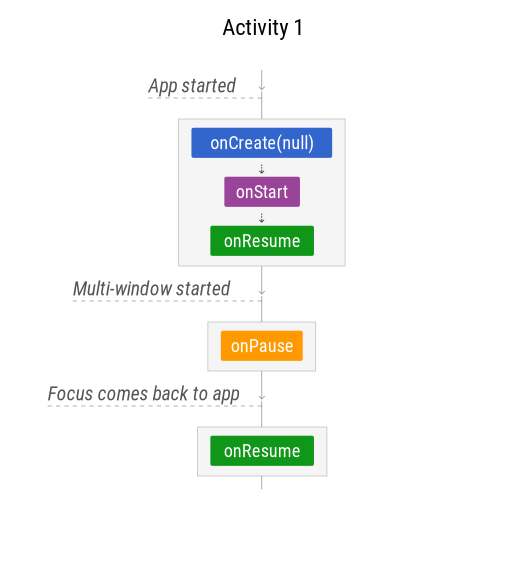
    
    Scenario k áp dụng cho TH:
    - Dialog của app đang chạy, như `AlertDialog `, `DialogFragment`
    - Thông báo mới, hoặc kéo thanh thông báo xuống

- **Scenario 5: Điều hướng giữa nhiều activity**

    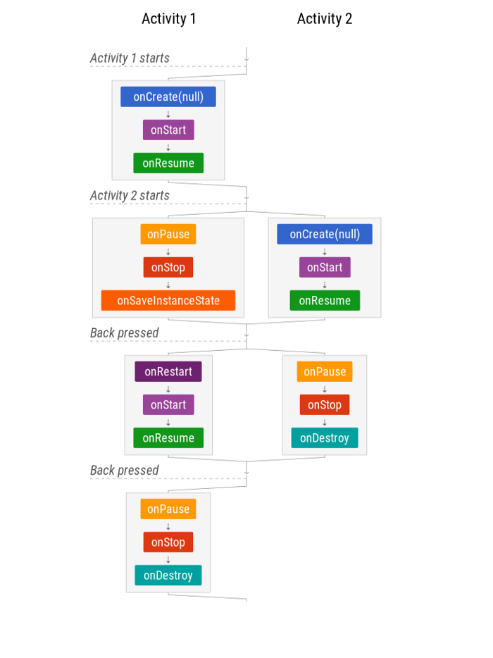

    - `onSaveInstanceState()` được gọi nhưng ` onRestoreInstanceState()` thì KHÔNG. Nếu configuration thay đổi ở acticity 2 thì activity 1 sẽ bị destroy và chỉ recreated khi nó được focus trở lại.

- **Scenario 6: Activities trong back stack với configuration changes**

    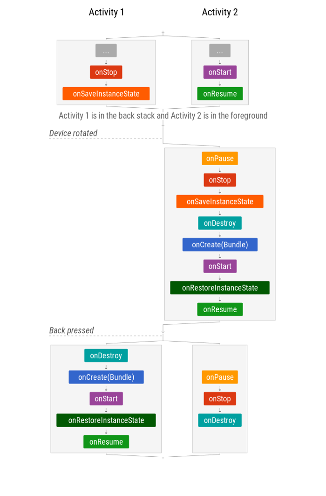

    - Tất cả activity trong stack cần khôi phục state sau khi configuration change để khởi tạo lại UI

- **Scenario 7: App’s process is killed**

    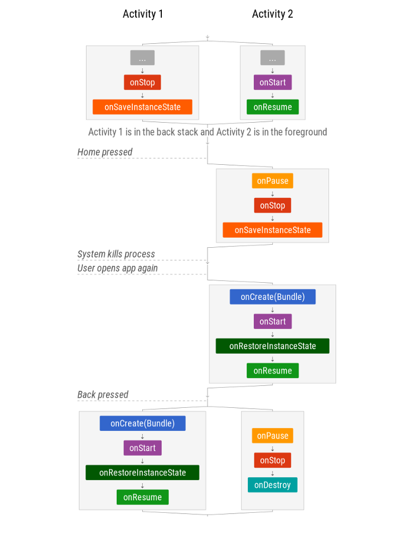

## 1.3 Task and Backstack

### **Task**

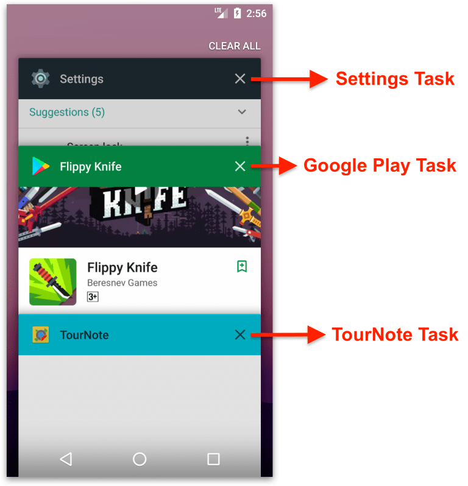
>Task là tập hợp gồm nhiều activity mà người dùng tương tác với ứng dụng khi thực hiện một công việc nhất định. Các activity được sắp xếp trong một stack (được gọi là Back stack), theo thứ tự mở của mỗi activity.

- Click app icon hoặc từ danh sách Task khi ấn Overview: tìm những task đã tồn tại -> task nào của ứng dụng đã tồn tại, ứng dụng sẽ được tiếp tục ->  Ngược lại, nếu ứng dụng chưa đc sử dụng, một task mới sẽ được tạo cùng với "main" activity của ứng dụng như là root (gốc) của Back stack.

### **Backstack**
> 1 cái chồng đĩa, mỗi đĩa là 1 activity :)

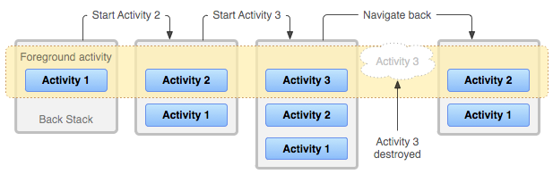
- activity1 `startActivity()` activity2: push activity2 lên trên cùng của backstack và giữ focus activity2 ở foreground. activity1 vẫn nằm trong stack, ở state stopped và ở background
- ấn back: activity trên cùng bị ném (pop) ra khỏi backstack và ở state destroyed. activity trước đó sẽ được tiếp tục. Nếu activity cuối cùng được pop ra khỏi backstack -> trở về màn hình chính, task của app đó sẽ k còn tồn tại
- Các activity trong Back stack sẽ không bao giờ được sắp xếp lại, mà chỉ được push hay pop từ stack theo đặc trưng của một stack LIFO (LAST IN FIRST OUT).
- Backstack k bị ảnh hưởng khi task nhảy từ background <-> foreground
- Nhiều task có thể được lưu giữ cùng lúc trong background. Tuy nhiên, nếu user chạy quá nhiều background task tại cùng thời điểm, hệ thống có thể hủy các background activity để khôi phục bộ nhớ, lúc này trạng thái của activity bị hủy sẽ mất đi.

### **Launch Mode**
>Launch mode cho phép ta định nghĩa cách mà một instance mới của một activity được liên kết với task hiện tại.

**Sử dụng Manifest**
```xml
<activity
    android:name=".SingleTaskActivity"
    android:launchMode="singleTask">
```
- `standard`: <br/>
    là giá trị mặc định, khi activity được khởi tạo, activity mới sẽ được đặt lên đỉnh của stack trong cùng 1 task.  Activity có thể được khởi tạo nhiều lần, mỗi instance của activity có thể thuộc về nhiều task khác nhau, và một task có thể có nhiều instance của một activity.

        Task: A -> B -> C
        Start C: A -> B -> C -> C
        Start B: A -> B -> C -> C -> B

- `singleTop`:<br/>
    tương tự `standard`, tuy nhiên mỗi activity luôn được đảm bảo chỉ có 1 thể hiện nằm trên top của task. Nếu activity đó có 1 thể hiện có sẵn trên top của task thì lần khởi chạy tiếp theo sẽ gọi lại thể hiện này thay thì tạo một thể hiện mới. Khởi chạy mới sẽ gọi callback `onNewIntent()`.

        Task: A -> B -> C
        Start C: A -> B -> C
        Start B: A -> B -> C -> B
- `singleTask`<br/>
    Hệ thống sẽ tạo một task mới, khởi tạo instance của activity và đưa vào vị trí root trong task mới(chỉ đúng khi thêm thuộc tính `taskAffinity` nếu không nó sẽ k tạo task mới mà chỉ tạo activity lên đầu của task hiện tại). <br/>
    Tuy nhiên nếu đối tượng activity này đã tồn tại ở bất kỳ task nào khác rồi thì hệ thống sẽ gọi activity đó thông qua phương thức `onNewIntent()` và các activity đặt trên nó sẽ bị kill. Chỉ có một instance của activity được tồn tại tại một thời điểm.
    - Ví dụ với không có `taskAffinity`: C là singleTask  

            Task1: A -> B
            Start C: A -> B -> C
            Start B, A: A -> B -> C -> B -> A
            Start C: A -> B -> C
    - Ví dụ với có `taskAffinity`: C là singleTask 

            Task1: A -> B
            Start C: Task2: C
            Start B, A: Task2: C -> B -> A
            Start C: Task2: C
            Task1 không thay đổi

- `singleInstance`<br>
    tương tự như singleTask, tạo một task mới, khởi tạo instance của activity và đưa vào vị trí root. Ngoại trừ việc hệ thống sẽ không đưa thêm bất kỳ activity nào vào task mới này.

        Task1: A -> B -> C (D là singleInstance)
        Start D: Task1 A -> B -> C
                 Task2 D
                 => D | C B A
        Start E: Task1 A -> B -> C -> E
                 Task2 D
                 => E C B A | D
        Start D: Task1 A -> B -> C -> E
                 Task2 D (gọi callback onNewIntent()) 
                 => D | E C B A

**Sử dụng intent flag**
```kotlin
val intent = Intent(ActivityA.this, ActivityB::class.java);
intent.addFlags(Intent.FLAG_ACTIVITY_SINGLE_TOP)
startActivity(intent)
```
- `FLAG_ACTIVITY_NEW_TASK`: tương tự `singleTask`
- `FLAG_ACTIVITY_SINGLE_TOP`: tương tự `singleTop`
- `FLAG_CLEAR_TASK`: tạo instance mới và và destroy hết toàn bộ Activity có trong stack
- `FLAG_CLEAR_TOP`: 
    
        Task: A -> B -> C -> D 
        Start B: A -> B

### **Dọn dẹp Back Stack**
- `alwaysRetainTaskState`: Nếu true trong root activity của task, tất cả activity trong stack của task đó sẽ luôn được giữ lại.

- `clearTaskOnLaunch`: Nếu true trong root activity của task, bất kỳ khi nào người dùng rời khỏi task và quay trở lại, chỉ còn root activity được giữ lại, kể cả khi người dùng chỉ rời đi trong một thời gian ngắn.

- `finishOnTaskLaunch`: Thuộc tính này tương tự như `clearTaskOnLaunch`, nhưng nó chỉ xảy ra trên một activity đơn lẻ, không phải trên toàn bộ task. Nó cũng có thể khiến bất kỳ activity nào bị hủy bỏ, kể cả là root activity. Khi nó được set là true, khi người dùng rời khỏi task, activity được set thuộc tính này sẽ không còn tồn tại.

### **Task Affinity**
### **Tạo một Task**
*continue*

# 2. Fragment

Fragment là một thành phần android độc lập, được sử dụng bởi một activity, giống như một sub-activity. Fragment có vòng đời và giao diện riêng. 

## 2.1 Lifecycle
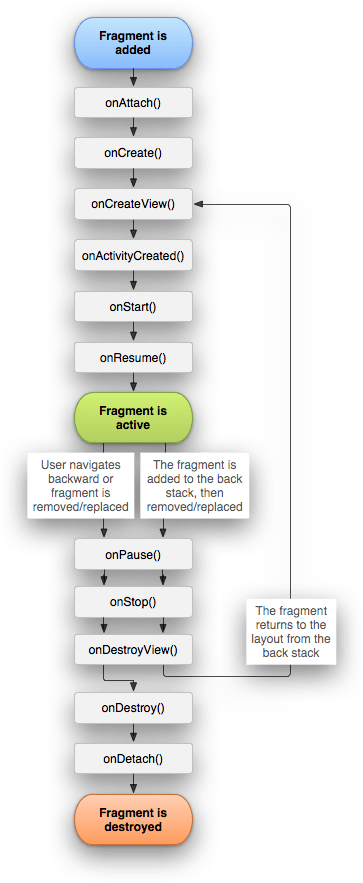

- `onAttach()`: fragment được gắn vào Activity
- `onCreate()`: khởi tạo dữ liệu đầu vào
- `onCreateView()`: vẽ UI
- `onActivityCreated()`: báo hiệu trạng thái Activity chứa nó được khởi tạo hoàn toàn
- `onStart()`: nhìn thấy
- `onResume()`: tương tác 
- `onPause()`: mất tương tác
- `onSaveInstanceState()`: lưu trạng thái fragment
- `onStop()`: không còn nhìn thấy
- `onDestroyView()`: xóa view
- `onDestroy()`: kết thúc việc dọn dẹp
- `onDetach()`: die, tách khỏi Activity

## 2.2 Scenarios of Lifecycle
- **Scenario 1: Activity with Fragment starts and finishes**

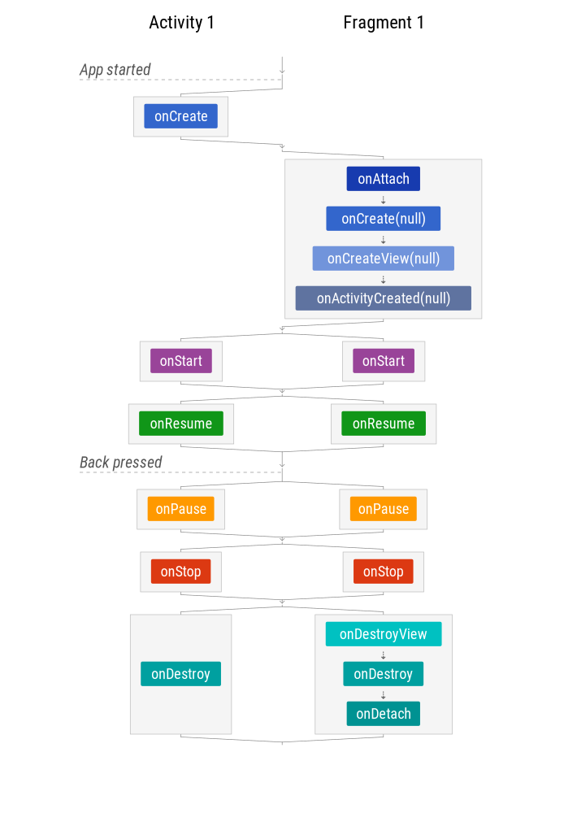

- **Scenario 2: Activity với Fragment được xoay**

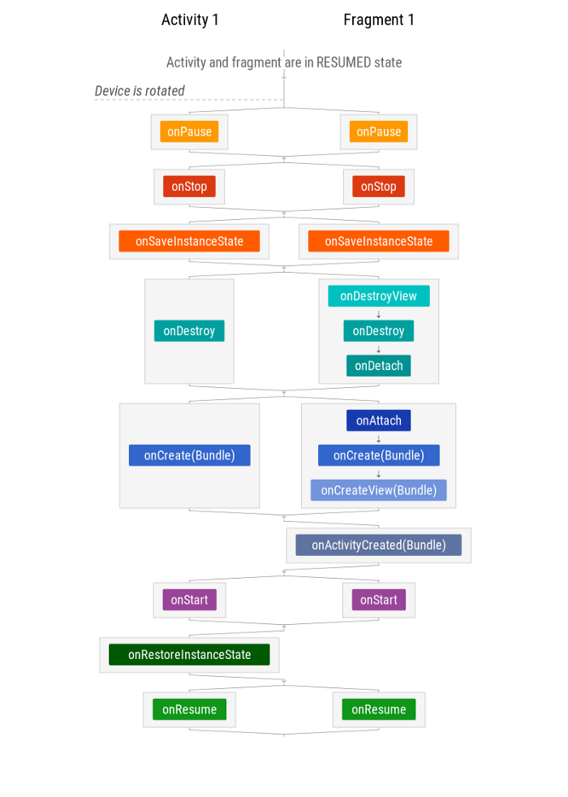

Tương tự với activity, điểm khác biệt là fragment `onRestoreInstanceState()`, nhưng bundle vẫn có trong `onCreate`, `onCreateView` và `onActivityCreated`

- **Scenario 3: Activity với Fragment được giữ lại trạng thái khi xoay**

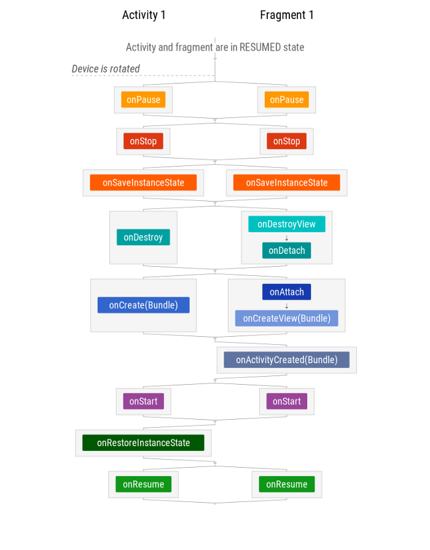

## 2.3 Static Fragment

là kiểu fragment được khai báo (định nghĩa) trực tiếp trong file activity.xml

```xml
<LinearLayout
    android:id="@+id/activity_main_content"
    android:layout_width="match_parent"
    android:layout_height="match_parent"
    android:orientation="vertical"
    tools:context="com.vit.MainActivity">
 
    <fragment
        android:layout_width="match_parent"
        android:layout_height="0dp"
        android:layout_weight="1"
        android:name="com.vit.FirstFragment"/>
 
    <fragment
        android:layout_width="match_parent"
        android:layout_height="0dp"
        android:layout_weight="2"
        android:name="com.vit.SecondFragment"/>
 
</LinearLayout>
```
## 2.4 Dynamics Fragment
khai báo một vùng không gian nào đó sẽ chứa đựng Fragment, vùng không gian đó được khai báo bằng một FrameLayout.

```xml
<LinearLayout
    android:id="@+id/activity_main_content"
    android:layout_width="match_parent"
    android:layout_height="match_parent"
    android:orientation="vertical"
    tools:context="com.vit.MainActivity">
 
    <FrameLayout
        android:id="@+id/firstFrame"
        android:layout_width="match_parent"
        android:layout_height="0dp"
        android:layout_weight="1"/>
 
    <FrameLayout
        android:id="@+id/secondFrame"
        android:layout_width="match_parent"
        android:layout_height="0dp"
        android:layout_weight="2"/>
 
</LinearLayout>
```

### **FragmentManager**
cho phép thêm, xóa, thay thế fragment trong layout của activity. Sử dụng phương thức getFragmentManager()(minsdk > 14) hoặc getSupportFragmentManager()(minsdk < 14 và có sử dụng các support package) để lấy ra một đối tượng FragmentManager

### **FragmentTransaction**
Khi đã có `FragmentManager`, thực hiện việc thêm, xóa, thay đổi các Fragment dựa vào `FragmentTransaction`, “triệu hồi” FragmentTransaction thông qua phương thức `beginTransaction()` từ FragmentManager.
- `add()`: add Fragment vào FrameLayout (lúc đó chưa chứa Fragment nào)
- `replace()`: thay thế một Fragment đang có sẵn ở FrameLayout bằng một Fragment nào đó khác
- `remove()`: gỡ bỏ Fragment ra khỏi một FrameLayout 
- `commit()`: báo cho FragmentTransaction thực hiện các transaction đã ra lệnh
- `addToBackStack()`: với `replace()` và `remove()`, gọi `addToBackStack()` trước khi commit để thêm fragment vào backstack

```java
FragmentManager fm = getFragmentManager();

// add
FragmentTransaction ft_add = fm.beginTransaction();
ft_add.add(R.id.your_placehodler,new YourFragment());
ft_add.commit();

// replace
FragmentTransaction ft_rep = fm.beginTransaction();
ft_rep.replace(R.id.your_placehodler, new YourFragment());
ft_rep.commit();

// remove
Fragment fragment = fm.findFragmentById(R.id.your_placehodler);
FragmentTransaction ft_remo = fm.beginTransaction();
ft_remo.remove(fragment);
ft_remo.commit()
```

## 2.5 Backstack trong Fragment
Hệ thống vẫn dùng Back Stack của Activity để quản lý luôn Fragment<br>
Với những fragment bị xóa hoặc
thay thế sẽ bị hủy theo vòng đời, khi cần thao tác lại, ta phải tạo lại fragment.
Để tránh sự bất tiện này, mỗi khi thêm, xóa, thay thế fragment, ta có thể thêm transaction vào
backstack. Lúc này, khi thực hiện remove hoặc replace, fragment sẽ chạy vào callback onStop()
thay vì bị hủy. Khi người dùng ấn back để khôi phục lại thao tác với fragment đó thì fragment
được restart và chạy vào callback onRestart().
- Cơ chế hoạt động với transaction của BackStack:
Khi người dùng ấn nút Back, transaction sẽ được đảo ngược hành động trước đó.
Mỗi transaction trong backstack sẽ được đảo ngược cho đến khi activity chứa chúng bị hủy.
## 2.6 Note

### FragmentTransaction: add và replace
Giả sử chúng ta có Activity chứa một container và container này chứa các fragment của chúng ta.

- `add` cơ bản sẽ thêm fragment vào container, ví dụ như chúng ta add FragmentA và FragmentB vào container. Container sẽ chứa FragmentA và FragmentB. Đồng thời container là một Framlayout thì các fragment sẽ được thêm cái này trên cái kia. 
- `replace` sẽ thay thế fragment trên top của container, vì vậy nếu chúng ta tạo FragmentC và gọi replace, thì FragmentB hiện đang trên top của container sẽ bị remove và thay thế bằng FragmentC trừ khi chúng ta gọi phương thức addToBackStack

Vậy chúng ta nên dùng cái nào khi nào, replace sẽ remove fragment đăng tồn tại và và add fragment mới, điều này có nghĩa là khi chúng ta nhấn back button thì fragment đã được replaced sẽ được tạo lại và onCreateView sẽ được invoked. Trái lại, add sẽ giữ lại fragment hiện tại và thêm một fragment mới, fragment hiện tại sẽ được active và sẽ không được 'paused' trạng thái, do đó khi nhấn back button onCreateView sẽ không được gọi lại. Về mặt vòng đời của fragment các sự kiện onPause, onResume, onCreateView và các sự kiện vòng đời khác sẽ bị invoked trong trường hợp chúng ta sử dụng replace. Sẽ không invoked khi ta sử dụng add

### getSupportFragmentManager vs getChildFragmentManager
- `getSupportFragmentManager`: được liên kết với Activity và chúng ta có thể xem nó như là Fragment Manager của Actitity -> mỗi khi sử dụng ViewPager, BottomSheetFragment và DialogFragment trong một Activity bạn sẽ dùng `getSupportFragmentManager`
- `getChildFragmentManager` :  được liên kết với Fragment -> sử dụng ViewPager trong Fragment sẽ dùng `getChildFragmentManager`

>Memory leaks khi sử dụng getSupportFragmentManager cho ViewPager(hoặc các child fragment) trong Fragment. nếu close parent fragment, nó sẽ được close nhưng không được destroyed. Bởi vì tất child fragments đều ở trong Activity và chúng sẽ còn tồn tại trong bộ nhớ, dẫn đến việc nó sẽ không được phép destroy parent fragment đây là nguyên nhân của việc leak -> So never try to use getSupportFragmentManager in a Fragment

### Callback từ DialogFragment, ChildFragment, BottomSheetFragment đến parent fragment
Muốn có một callback từ child fragments đến parent fragments, hầu hết mọi người thường làm là kết nối giữa 2 fragment bằng việc sử dụng activity, hoặc truyền các interface listeners như một parameter vào fragment, đây thực sự là một việc không đúng. Cách tốt nhất là getParentFragment() từ child fragment để tạo callback.

```java
dialogFragment.show(getChildFragmentManager(), "dialog_fragment");
```
implement callback cho parent Fragment, rồi thêm đoạn code sau vào child fragment
```java
public void onCreate(Bundle savedInstanceState) {
    super.onCreate(savedInstanceState);
    try {
        callback = (Callback) getParentFragment();
    } catch (ClassCastException e) {
        throw new ClassCastException("Calling fragment must implement Callback interface");
    }
}
```
Bằng việc sử dụng cách này chúng ta có thể tạo một callback từ child fragment bên trong ViewPager cho parent fragment nắm giữ ViewPager này.

### onActivityResult với các nested fragment
onActivityResult trong các nested fragment sẽ không được gọi. Các việc gọi tuần tự của onActivityResult (trong Android support library) là:
1. `Activity.dispatchActivityResult()`
2. `FragmentActivity.onActivityResult()`
3. `Fragment.onActivityResult()`

Vì vậy chúng ta phải dùng onActivityResult() trong parent fragment hoặc activity và pass result vào nested fragment

```java
@Override
    public void onActivityResult(int requestCode, int resultCode, Intent data) {
        super.onActivityResult(requestCode, resultCode, data);
List<Fragment> fragments = getChildFragmentManager().getFragments();
        if (fragments != null) {
            for (Fragment fragment : fragments) {
                fragment.onActivityResult(requestCode, resultCode, data);
            }
        }
    }
```

### Tại sao không truyền tham số vào constructor Fragment
Fragment luôn luôn phải có một constructor rỗng, vì vậy nó có thể đc khởi tạo khi khôi phục trạng thái hoạt động của nó. Chúng ta được khuyến nghị rằng các subclass sẽ không có bất kì tham số nào khác. Vì constructor đó sẽ không được gọi khi fragment được khởi tạo lại. <br>
Đó là lý do tại sao chúng ta sẽ sử dụng Bundle để thay thế cho constructor trong việc truyền tham số cho fragment. Đây là cách để hệ thống dễ dàng trong việc khôi phục các giá trị khi fragment khởi tạo lại

[*continue* ](https://medium.com/mindorks/android-fragments-common-queries-common-mistakes-7b734650e52a)


# 3. Single Activity


# 4. View Group

## 4.1  Constraint Layout