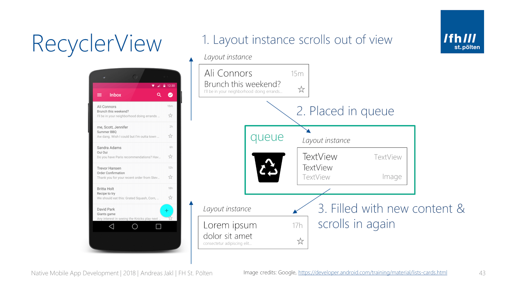
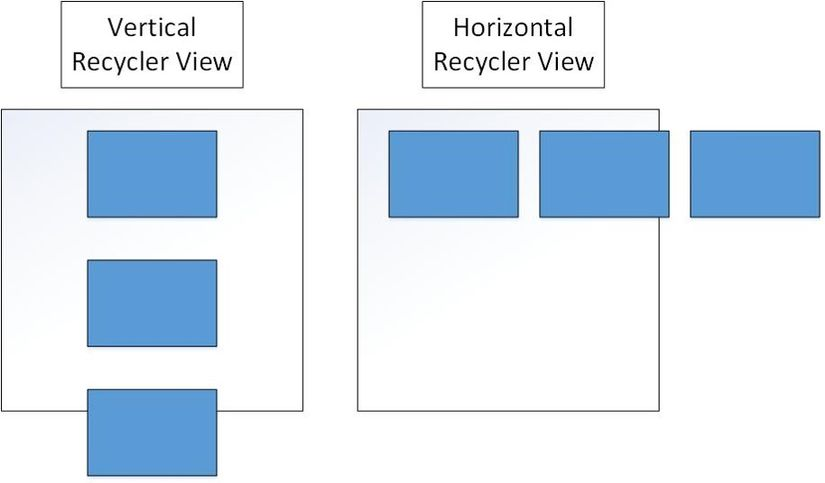
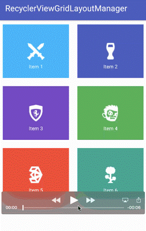
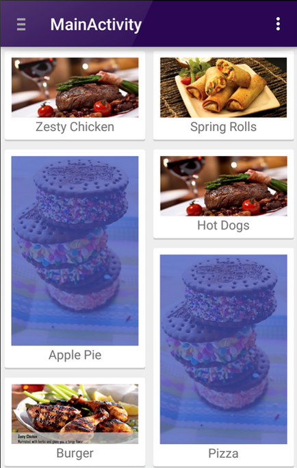
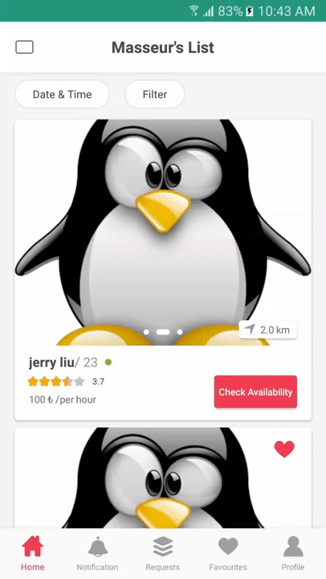
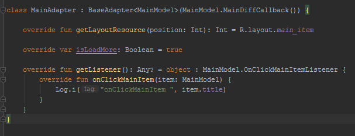
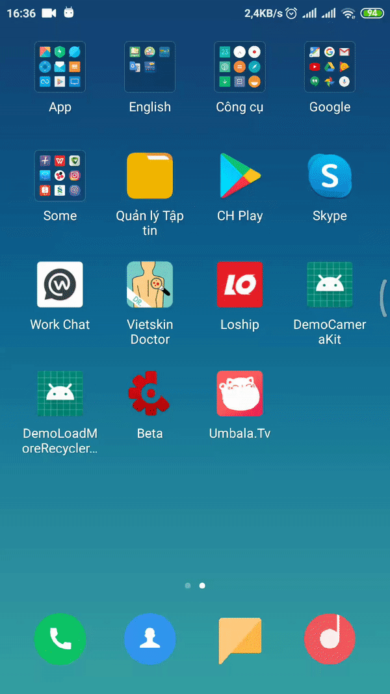
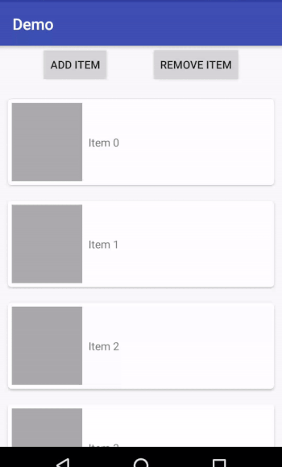

# RECYCLER VIEW

## 1. Cách hoạt động



Một khi RecyclerView được kết nối với Adapter , Adapter sẽ tạo ra đối tượng của các hàng (ViewHolder object) cho đến khi lấp đầy kích thước của RecyclerView và lưu trong HeapMemory . Sau đó sẽ không tạo thêm bất kỳ hàng nào để lưu trong bộ nhớ nữa Theo cách này nếu người dùng trượt danh sách, các item đã trượt khỏi màn hình sẽ được giữ ở trong bộ nhớ để tái sử dụng lại sau và mỗi khi một hàng mới được chèn vào màn hình thì đối tượng ViewHolder được lưu trong bộ nhớ sẽ được mang ra để tái sử dụng và gán dữ liệu . Nếu không gán lại dữ liệu cho ViewHolder object thì sẽ hiện thị dữ liệu được gán trước đó. Theo cách này thì kể cả danh sách có 1000 item, thì chỉ có khoảng 7 đối tượng ViewHolder được tạo ra .

- Khi danh sách được hiển thị lần đầu tiên , nó sẽ gán dữ liệu cho một vài ViewHoler object . Ví dụ nếu các View hiển thị trên màn hình có vị trí từ 0 - 9 , thì RecyclerView sẽ tạo và gán dữ liệu cho các ViewHolder đó, ngoài ra còn tạo thêm và gán dữ liệu cho View thứ 10 . theo cách này thì nếu người dùng trượt danh sách , thế View kế tiếp đã sẵn sàng để hiển thị .
- Nếu người dùng trượt danh sách , RecyclerView sẽ tạo mới một ViewHolder object nếu nó thực sự cần thiết. Và nó cũng lưu lại các ViewHolder object đã bị trượt khỏi màn hình để tái sử dụng lại sau. Nếu người dùng đổi hưởng trượt thì các ViewHolder Object vừa bị trượt ra khỏi màn hình sẽ đc show lại. Mặt khác nếu người dùng trượt danh sách theo cùng một hướng thì những ViewHolder nào bị trượt khỏi màn hình xa nhất sẽ được mang quay trở lại để gán dữ liệu mới. Viewholder sẽ không cần được tạo mới mà chỉ cập nhật dữ liệu của chúng.
- Khi các item được hiển thị thay đổi, bạn có thể thông báo cho adapter bằng cách gọi một phương thức RecyclerView.Adapter.notify ... () thích hợp. Mình sẽ nói rõ ở phần Adapter

## 2. Các thành phần của RecyclerView

### RecyclerView.Adapter
Có thể bạn ứ biết thì cái củ sạc điện thoại của bạn cũng được gọi là adapter đó, nó chuyển dòng điện dật chết người về các thông số mà điện thoại, laptop có thể nhận được :v tương tự vậy với recycler view, nó như 1 bộ chuyển đổi, lấy dữ liệu từ Datasource + kết hợp với Viewholder để pass sang LayoutManager hiển thị lên Rcv. Để implement nó cần override 3 hàm: 
- `getItemCount()` : cho biết số phần tử của dữ liệu
- `onCreateViewHolder` : tạo ra đối tượng ViewHolder, trong nó chứa View hiện thị dữ liệu
- `onBindViewHolder`: chuyển dữ liệu phần tử vào ViewHolder

### RecyclerView.ViewHolder
Là cái hồn của RecyclerView, sự khác biệt chính so với ListView hay GridView. Nó dùng để cache View trong bộ nhớ Heap. Mỗi 1 ViewHolder object tượng trưng cho 1 hàng item hiển thị trên mà hình. Như bên trên mình có giải thích, khi user cuộn xuống, các object này sẽ được tái chế lại view để bind dữ liệu lên

### LayoutManagers
Layout manager sẽ xác định các item bên trong RecyclerView được hiển thị như thế nào và khi nào phải tái sử dụng lại các item view (những item đã bị trượt khỏi màn hình)

- LinearLayoutManager : hiển thị các item trong danh sách có thể cuộn theo chiều dọc (horizontal) hoặc chiều ngang ( Vertical).


- GridLayoutManager : hiển thị các item trong danh sách theo dạng lưới.


- StaggeredGridLayoutManager : hiển thị các item trong danh sách theo dạng lưới so le nhau. 


- Bạn cũng có thể custom LayoutManager theo cách của bạn :D. Còn nếu k set LayoutManager, thì rcv sẽ k hiển thị và log này sẽ đc show 
>E/RecyclerView: No layout manager attached; skipping layout

### ItemAnimator
RecyclerView.ItemAnimator sẽ tạo ra các hiệu ứng cho ViewGroup khi các item thay đổi như thêm, sửa, xóa. DefaultItemAnimator được sử dụng cho các hoạt ảnh cơ bản và nó hoạt động khá ổn. Bạn cũng có thể custom nó, nếu lười thì [Đây](https://github.com/wasabeef/recyclerview-animators) là 1 thư viện sẽ giúp bạn :D

### ItemDecoration
Các phần tử được vẽ trong RecyclerView, có thể thêm các trang trí (vẽ thêm vào) ví dụ sau mỗi phần tử có đường kẻ ngang phía dưới, phía trên, hay khoảng cách giữa các phần tử... đây là 1 ví dụ đơn giản, nếu bạn muốn đâm sâu vào nó hãy bay sang [đây](https://kipalog.com/posts/Android--Implement-StickyHeaderRecyclerView-voi-ItemDecoration-cua-RecyclerView)

```java

//Chèn một kẻ ngang giữa các phần tử
DividerItemDecoration dividerHorizontal =
    new DividerItemDecoration(this, DividerItemDecoration.VERTICAL);

recyclerView.addItemDecoration(dividerHorizontal);

//Chèn một kẻ đứng giữa các phần tử
DividerItemDecoration dividerVertical =
    new DividerItemDecoration(this, DividerItemDecoration.HORIZONTAL);
recyclerView.addItemDecoration(dividerVertical);
```

## 3. Cải thiện hiệu năng của RecyclerView

### setHasFixedSize 
`recyclerView.setHasFixedSize(true)`: nói với RecyclerView rằng không tính toán kích thước của các View mỗi lần chúng được thêm vào hoặc bị đẩy ra khỏi RecyclerView

### setItemViewCacheSize 
`recyclerView.setItemViewCacheSize(20)`: Khi thêm dòng này vào phần khởi tạo của RecyclerView thì chúng ta sẽ tùy chỉnh lại số lượng các ViewHolder sẽ được lưu lại trước khi chúng bị đưa vào nhóm ViewHolder có khả năng được tái sử dụng để gán data mới Thêm vào đó các ViewHolder này cũng nhận biết được có sự thay đổi về datasource cho phép Layoutmanager tái sử dụng lại các ViewHolder không bị sửa đổi mà không cần phải tái sử dụng lại ViewHolder( Cụ thể là gán lại data cho chúng)

Một cách dễ hiểu hơn là khi chúng ta cuộn RecyclerView sao cho các item gần như biến mất hoàn toàn khỏi màn hình. Thì RecyclerView sẽ giữ chúng lại để khi cuộn theo chiều ngược lại thì các item được mang trở lại ngay lập tức mà không cần phải tái sử dụng lại ViewHolder rồi gán lại data cho chúng

### setHasStableIds 
`adapter.setHasStableIds(true)`
`override fun getItemId(position: Int): Long { return position.toLong() }`  Khi này RecyclerView sẽ tổng hợp lại các sự kiện thay đổi cho adapter và báo cáo ID của chúng. Điều này có thể giúp cho animation và các sự kiện của các itemView đang hiển thị sẽ vẫn được phản hồi tới người dùng. 

### Không lên sử dụng ConstraintLayout ở trong RecyclerView
ConstraintLayout là ViewGroup tuyệt vời để thiết kế, nó rất dễ sử dụng và dễ hiểu, nhưng trong trường hợp này, mình nghĩ rằng nó thực sự rất tệ. Nó rất nặng về việc inflate và rằng buộc giữa các view ở trong itemView. 

Với ConstraintLayout: 



Và không sử dụng ConstraintLayout:


### Dùng SnapHelper trong Recycler View thay cho ViewPager


Ở đây chúng ta có một RecyclerView với các ItemView được bố trí theo chiều dọc và bên trong mỗi ItemView có một danh sách các ảnh trượt theo chiều ngang. Các danh sách Ngang này là PhotoSlider và nếu chúng ta search cách tạo ra cái Photoslider này thì đa số kết quả sẽ chỉ cho bạn rằng sử dụng ViewPager để tạo ra PhotoSlider

Nhưng trong trường hợp này , trong RecyclerView có nhiều ItemView trong mỗi ItemView lại có ViewPager và vấn đề giật lag ở đây là do một fragment ở trong ViewPager sẽ chỉ dùng để hiển thị một hình ảnh. Do đó cách giải quyết tối ưu trong trường hợp này là sử dụng một RecyclerView ngang với linearSnapHelper () để hoạt động như ViewPager thay vì ViewPager cho PhotoSlider.

### Cải thiện Nest Recycler View với RecycledViewPool

Trong Nest(lồng nhau) Recycler View, khi người dùng vuốt theo chiều ngang, mỗi RecyclerView bên trong sẽ tái sử dụng các views và cho bạn một trải nghiệm cuộn trơn tru. Khi người dùng cuộn theo chiều dọc, thì mỗi RecyclerView trong ItemView bên trong sẽ được inflate (khởi tạo) lại. Điều này xảy ra là do mỗi RecyclerView lồng nhau có một khung nhìn (view pool) riêng của nó.

Chúng ta có thể tối ưu bằng cách tạo một view pool duy nhất cho tất cả các RecyclerViews bên trong.
```java
public OuterRecyclerViewAdapter(List<Item> items) {
    //Constructor stuff
    viewPool = new RecyclerView.RecycledViewPool();
}
@Override
public ViewHolder onCreateViewHolder(ViewGroup parent, int viewType) {
    //Create viewHolder etc
    holder.innerRecyclerView.setRecycledViewPool(viewPool);
    
}

Khi đó các RecyclerViews bên trong có cùng một view pool. Với cách làm này sẽ giúp RecyclerView có thể sử dụng lịch sử view của nhau, từ đó cải thiện đáng kể hiệu năng
```

>Nguồn [1](https://blog.usejournal.com/improve-recyclerview-performance-ede5cec6c5bf) [2](https://viblo.asia/p/su-dung-recyclerview-trong-android-RQqKLNe6l7z) [3](https://viblo.asia/p/su-dung-recyclerview-trong-android-phan-2-Eb85omPBZ2G) [4](https://xuanthulab.net/su-dung-recyclerview-trong-lap-trinh-android.html)
# BEST PRACTICE: RECYCLER VIEW WITH DATABIDING AND LISTADAPTER 

Mình là 1 con người thích sự đơn giản và không thích viết đi viết lại 1 đoạn code quá nhiều lần. Cứ dễ hiểu, đơn giản, viết code ít là mình quất. Chém cho bon mồm thế thôi chung quy lại vẫn là do tính lười :v Vì vậy trong bài này mình sẽ đi sâu 1 chút về thực hành, làm sao để tạo BaseAdapter có thể covert được hầu hết các trường hợp sử dụng cơ bản của recycler view mà hiệu năng cũng được tối ưu hết cỡ. Để khi tạo hàng chục adapter, ta chỉ việc kế thừa BaseAdapter và viết 1 2 dòng là done, giảm thiểu viết code lặp, dễ nhìn trong trắng à nhầm trong sáng.

Đại khái thì hàng nó ntn: 



Kết quả: 



# ListAdapter

Từ thuở sơ khai cho đến tận ngày này, `RecyclerView.Adapter` vẫn đang thống trị thế giới dev android, nhưng nó vẫn có 1 số điều hạn chế. Khi có sự thay đổi database (thêm sửa xóa), chúng ta set lại list ntn? Cao thủ thì dùng `notifyItemChanged(int pos)`, `notifyItemInserted(int pos)`, `notifyItemRemoved(int pos)` cơ mà phức tạp vãi chưỡng. Gà mờ như mình thì làm phát `notifyDataSetChanged()` cho ăn chắc cái đã, cơ mà cách này thì hiệu năng rất thấp, đặc biệt là với list nhiều item, View bị nháy, và animation k có, trải nhiệm người dùng ứ sướng.

Để khắc phục nhược điểm đó thì DiffUtils (sử dụng thuật toán của Eugene W. Myers để tính số cập nhật tối thiểu) ra đời nhưng vẫn phức tạp, r mới năm 2018 thì phải, ListAdapter ra đời sp cho DiffUtils, khiến cho mọi việc ngon ngọt hơn. All hàm trên thay bằng `summitList()`, so izi, tính toán, thuật toán thế nào thì kệ mé nó hôi =))) Đây là 1 xíu animation sau khi dùng ListAdapter:



## DiftUtils

Trước khi tìm hiểu ListAdapter là gì, chúng ta cùng đả lại 1 thứ mà có thể bạn chưa biết đó là `DiffUtils`.

`DiffUtil` là 1 Class cung cấp các hàm tính toán sự khác biệt giữa 2 danh sách và đưa ra 1 danh sách sự thay đổi (thêm phần tử, xóa và chỉnh sửa phần tử) giữa 2 danh sách đó. Dựa vào đó thì DiffUtil được sử dụng để tính toán sự khác biệt về dữ liệu của RecyclerView trong 2 lần cập nhật. Hơn nữa DiffUtil còn cung cấp thêm lựa chọn có thể chạy ở background thread. Để implement nó thì cũng có vài hàm khá mệt, nhưng giờ có listAdapter rồi nên chúng ta chỉ cần mỗi cái `DiffUtil.ItemCallback` hôi, trông nó ntn: 

```kotlin
data class MainModel(val id: String, val title: String) {

    class MainDiffCallback : DiffUtil.ItemCallback<MainModel>() {

        override fun areItemsTheSame(oldItem: MainModel, newItem: MainModel) = oldItem.id == newItem.id

        override fun areContentsTheSame(oldItem: MainModel, newItem: MainModel) = oldItem == newItem
    }
}
```

`DiffUtil.ItemCallback` yêu cấu chúng ta override 2 hàm để thực hiện việc so sánh.

- Hàm `areItemsTheSame` để kiểm tra xem 2 Object có khác nhau hay không, thường ở đây mọi người lên so sánh 2 khóa chính (những gì mà chỉ Object đấy có hoặc điểm khác nhau đặc trưng giữa 2 đối tượng) của 2 object
- Hàm `areContentsTheSame` là để kiểm tra sự khác biệt về giữa liệu giữa 2 Object có cùng khóa chính. Các bạn lưu ý ở đây mình viết return oldItem == newItem là do object MainModel mình sử dụng kiểu data class của Kotlin nên khi so sánh oldItem == newItem thực chất là so sánh các trường nằm trong class. Còn nếu bạn dùng class thường thì ở đây là nơi bạn định nghĩa những trường nào thay đổi trong Object

## ListAdapter

`ListAdapter` thực chất là 1 Wraper của `RecyclerView.Adapter` và cung cấp thêm cho chúng ta các sự kiện, các hàm để hỗ trợ DiffUtil

Khi implement ListAdapter với cái DiffUtils ở trên thì cũng sâu i zi, k khác gì adapter thường ngoài việc extend adapter từ ListAdapter: 

```kotlin
class MainAdapter: ListAdapter<MainModel, MainAdapter.MainViewHolder>(
    AsyncDifferConfig.Builder<MainModel>(MainModel.MainDiffCallback())
        .setBackgroundThreadExecutor(Executors.newSingleThreadExecutor())
        .build()
) {
    override fun onBindViewHolder(holder: MainViewHolder, position: Int) {
        holder.bindData(getItem(position), clickListener)
    }

    override fun onCreateViewHolder(parent: ViewGroup, viewType: Int): MainViewHolder {
        val inflater = LayoutInflater.from(parent.context)
        return MainViewHolder(inflater.inflate(R.layout.item_note, parent,  false))
    }
}
```

và k cần override lại `getItemCount()` hay tạo list chứa model trong adapter nữa. list trong đây là `currentList` được tạo sẵn trong ListAdapter rồi, ae chỉ việc lôi ra sài hôi. 1 điều nữa cũng chả cần tạo hàm set lại list khi có thay đổi, sài luôn `summitList(list)`. Mọi tính toán hay notify cứ để thằng cha ListAdapter lo. Sao mà nó dễ thế k biết :v 

```kotlin
 AsyncDifferConfig.Builder<MainModel>(MainModel.MainDiffCallback())
        .setBackgroundThreadExecutor(Executors.newSingleThreadExecutor())
        .build()
```

Thằng cu này để chỉ định là MainDiffCallback được chạy dưới BackgroundThread để tránh gây giật lag View

# Databinding

Bạn nào biết rồi thì lượn khỏi đọc nữa nha, nhảy sang phần sau đê :D
Bài viết tập trung vào recycler view lên mình sẽ chỉ nói ngắn gọn ntn, nó là cái thứ mà cho dev nhồi 1 thằng object vô file layout, rồi lấy các thuộc tính của object đó set trực tiếp vô View trong layout. Trông nó ntn:

```xml
<?xml version="1.0" encoding="utf-8"?>
<layout xmlns:android="http://schemas.android.com/apk/res/android">
    <data>
        <variable
                name="item"
                type="com.vit.demoloadmorerecyclerview.ui.MainModel"/>

        <variable
                name="listener"
                type="com.vit.demoloadmorerecyclerview.ui.MainModel.OnClickMainItemListener"/>

    </data>
    <TextView
            android:padding="20dp"
            android:onClick="@{() -> listener.onClickMainItem(item)}"
            android:text="@{item.title}"
            android:layout_width="match_parent"
            android:layout_height="wrap_content"/>
</layout>
```

xong rồi trong java code set cho cái object đã gắn vào layout đó. thế hôi, để biết thêm chi tiết xem [Doc](https://developer.android.com/topic/libraries/data-binding)

# BaseAdapter

Mọi lí thuyết đã xong, cái quan trọng mình muốn nói ở bài này là kết hợp 2 thằng ListAdapter và Databinding để đẻ ra thằng BaseAdapter để cuộc đời trở lên tươi đẹp hơn, giống như đưa cho nông dân chiếc máy cầy thay vì cái cày và con trâu và sức người :D

Bây giờ chúng ta sẽ đi từng bước để thực hiện nha: 

## 1. Model
Object Model Chứa DiffUtil và listener khi click vô item
```kotlin
//MainModel.kt

data class MainModel(val id: String, val title: String) {

    class MainDiffCallback : DiffUtil.ItemCallback<MainModel>() {

        override fun areItemsTheSame(oldItem: MainModel, newItem: MainModel) = oldItem.id == newItem.id

        override fun areContentsTheSame(oldItem: MainModel, newItem: MainModel) = oldItem == newItem
    }

    interface OnClickMainItemListener{
        fun onClickMainItem(item: MainModel)
    }
}
```

## 2. Item layout
Flow theo databinding, chứa `item` và `listener` là model và sự kiện click item vừa tạo ở trên
```xml
<!--main_item.xml-->

<?xml version="1.0" encoding="utf-8"?>
<layout xmlns:android="http://schemas.android.com/apk/res/android">
    <data>
        <variable
                name="item"
                type="com.vit.demoloadmorerecyclerview.ui.MainModel"/>

        <variable
                name="listener"
                type="com.vit.demoloadmorerecyclerview.ui.MainModel.OnClickMainItemListener"/>

    </data>
    <TextView
            android:padding="20dp"
            android:onClick="@{() -> listener.onClickMainItem(item)}"
            android:text="@{item.title}"
            android:layout_width="match_parent"
            android:layout_height="wrap_content"/>
</layout>
```

Tiện thể thêm cái layout item cho loadmore: 

```xml
<!-- item_load_more.xml -->
<?xml version="1.0" encoding="utf-8"?>
<layout xmlns:android="http://schemas.android.com/apk/res/android">
    <RelativeLayout
            android:layout_width="match_parent"
            android:layout_height="30dp">
        <ProgressBar
                android:layout_centerHorizontal="true"
                android:layout_width="20dp"
                android:layout_height="20dp"/>
    </RelativeLayout>
</layout>
```

## 3. BaseViewHolder

```kotlin
//BaseViewHolder.kt

open class BaseViewHolder<T>(
    private val binding: ViewDataBinding,
    private val listener: Any?
) :
    RecyclerView.ViewHolder(binding.root) {

    open fun bindData(t: T? = null, childAdapter: Any? = null) {
        if (t != null) binding.setVariable(BR.item, t)
        if (listener != null) {
            binding.setVariable(BR.listener, listener)
        }
        if (childAdapter != null) {
            binding.setVariable(BR.adapter, childAdapter)
        }
        binding.executePendingBindings()
    }
}
```

T là 1 generic, ở đây là kiểu của object model.

Hàm `bindData()` phục vụ cho `onBindViewHolder()` trong adapter.

`BR` là 1 class được auto gen để chứa các id của resource trong layout có sử dụng data binding. Thằng `BR.item` là 1 biến int final được auto gen ra trong class BR khi chúng ta khai báo ntn và cũng là id của nó luôn

```xml
<variable
        name="item"
        type="com.vit.demoloadmorerecyclerview.ui.MainModel"/>
```

`childAdapter` được sử dụng trong TH adpater lồng adapter

Để tránh crash với 1 số adapter k có các `item` hay `listener` ta lên check null r hãng set binding.

## 4. BaseAdapter

```kotlin
abstract class BaseAdapter<T>(diffCallback: DiffUtil.ItemCallback<T>) : ListAdapter<T, BaseViewHolder<T>>(
    AsyncDifferConfig.Builder<T>(diffCallback)
        .setBackgroundThreadExecutor(Executors.newSingleThreadExecutor())
        .build()
) {

    @LayoutRes
    @NonNull
    abstract fun getLayoutResource(position: Int): Int

    open fun getListener(): Any? = null

    open fun getChildAdapter(item: T): Any? = null

    open var isLoadMore = false

    val state = ObservableInt().apply {
        set(INIT_STATE)
    }

    private val childAdapters = ArrayList<Any>()

    override fun onCreateViewHolder(viewGroup: ViewGroup, viewType: Int): BaseViewHolder<T> {
        val binding =
            DataBindingUtil.inflate<ViewDataBinding>(LayoutInflater.from(viewGroup.context), viewType, viewGroup, false)
        return BaseViewHolder(binding, getListener())
    }

    override fun onBindViewHolder(holder: BaseViewHolder<T>, position: Int) {
        if (position >= currentList.size) {
            holder.bindData()
            return
        }
        val childAdapter = getChildAdapter(getItem(position))
        childAdapter?.let { childAdapters.add(it) }
        holder.bindData(getItem(position), childAdapter = childAdapter)
    }

    override fun getItemCount(): Int {
        return if(isLoadMore && currentList.isNotEmpty()) currentList.size + 1 else currentList.size
    }

    override fun getItemViewType(position: Int): Int {
        return if (position == currentList.size) R.layout.item_load_more
        else getLayoutResource(position)
    }

    fun setList(list: List<T>) {
        if (list.isEmpty()) {
            submitList(null)
            notifyDataSetChanged()
        } else submitList(list)
        state.apply {
            set(list.size)
            notifyChange()
        }
    }

    fun addList(list: List<T>) {
        if (list.isEmpty()) {
            isLoadMore = false
            notifyItemChanged(currentList.size)
            return
        }
        val l = currentList.toMutableList()
        l.addAll(list)
        setList(l)
    }

    fun loading() {
        state.apply {
            set(LOADING_STATE)
            notifyChange()
        }
    }

    fun error() {
        state.apply {
            set(ERROR_STATE)
            notifyChange()
        }
    }

    @Nullable
    fun getItemByPosition(position: Int): T? = if (position >= itemCount) null else currentList[position]

    @Nullable
    fun getChildAdapterByPosition(position: Int): Any? = if (position >= itemCount) null else childAdapters[position]

    companion object {
        const val EMPTY_STATE = 0
        const val INIT_STATE = -1
        const val LOADING_STATE = -2
        const val ERROR_STATE = -3
    }
}
```

Các TH hợp use: 
- loadmore
- nodata view
- error view
- loading view
- lồng adapter

Giải thích chút:
- `state` là 1 `ObservableInt` để thông báo cho view rằng quá trình load data như đang loading, error, hoặc success (là size của list). Cái này bạn có thể dùng hoặc không. Nếu dùng ViewModel thì mình nghĩ là không cần.
-  `childAdapters` dùng cho TH 1 adapter phức tạp chứa 1 adapter khác, vẫn dùng đc cái Base này ngon lành
- `getListener` sự kiện click item nếu cần sẽ được override lại ở adapter thật
- `isLoadMore` chế độ loadmore, mặc định là false
- `getLayoutResource` là thằng item layout đóa 
- `addList` dùng khi loadmore

có thể các bạn sẽ khó hiểu 1 chút cơ mờ cứ thử copy vô project và dùng thử là hiểu :v

## 5. Adapter
và đây là thành quả khi extend từ BaseAdapter, khá ngắn gọn, giảm bớt code mẫu, với các TH nhiều item cũng dễ handle trong getLayoutResource với position hoặc adapter lồng thì gọi `getChildAdapter` hôi

```kotlin
//MainAdapter.kt

class MainAdapter : BaseAdapter<MainModel>(MainModel.MainDiffCallback()) {

    override fun getLayoutResource(position: Int): Int = R.layout.main_item

    override var isLoadMore: Boolean = true

    override fun getListener(): Any? = object : MainModel.OnClickMainItemListener {
        override fun onClickMainItem(item: MainModel) {
            Log.i("onClickMainItem ", item.title)
        }
    }
}
```

## 6. Activity

```kotlin
//MainActivity.kt

class MainActivity : BaseActivity<MainActivityBinding>() {

    override fun getLayoutResource(): Int = R.layout.main_activity

    private val mainAdapter = MainAdapter()

    override fun onCreate(savedInstanceState: Bundle?) {
        super.onCreate(savedInstanceState)

        with(binding) {
            adapter = mainAdapter

            rcv.setLoadMoreListener<LinearLayoutManager> {
                postDelay(500) { mainAdapter.addList(fetchData(it)) }
            }

            layoutRefresh.setOnRefreshListener {
                getListFromServer()
            }
        }

        getListFromServer()
    }

    fun getListFromServer() {
        mainAdapter.loading()
        when(Random.nextInt(1, 4)) {
            1 -> postDelay(1000) { mainAdapter.setList(fetchData()) }
            2 -> postDelay(1000) { mainAdapter.setList(emptyList()) }
            3 -> postDelay(1000) { mainAdapter.error() }
        }
    }

    fun fetchData(offset: Int = 0) = ArrayList<MainModel>().apply {
        if(offset < 101) for (i in offset+1..offset+20) add(MainModel("id$i", "title $i"))
    }
}
```

`getListFromServer()` giả lập cuộc gọi từ server như list rỗng thì hiện no data view, error thì hiện error view, và TH success có data với hàm `fetchData`

`layoutRefresh.setOnRefreshListener` TH sử dụng SwipRefershLayout để load lại list

`rcv.setLoadMoreListener<LinearLayoutManager>` TH load more

## 7. Activity Layout

```xml
<!-- main_activity.xml -->

<?xml version="1.0" encoding="utf-8"?>
<layout xmlns:android="http://schemas.android.com/apk/res/android" xmlns:tools="http://schemas.android.com/tools"
        xmlns:app="http://schemas.android.com/apk/res-auto">
    <data>
        <variable
                name="adapter"
                type="com.vit.demoloadmorerecyclerview.ui.MainAdapter"/>

        <import type="android.view.View"/>
    </data>
    <RelativeLayout
            android:layout_width="match_parent"
            android:layout_height="match_parent"
            tools:context=".ui.MainActivity">

        <androidx.swiperefreshlayout.widget.SwipeRefreshLayout
                android:id="@+id/layout_refresh"
                app:refreshing="@{adapter.state.get() == -2 &amp;&amp; viewLoading.getVisibility() == View.GONE}"
                android:layout_width="match_parent"
                android:layout_height="match_parent">

            <androidx.recyclerview.widget.RecyclerView
                    android:id="@+id/rcv"
                    android:adapter="@{adapter}"
                    android:orientation="vertical"
                    app:layoutManager="androidx.recyclerview.widget.LinearLayoutManager"
                    android:layout_width="match_parent"
                    android:layout_height="match_parent"/>

        </androidx.swiperefreshlayout.widget.SwipeRefreshLayout>

        <ProgressBar
                android:id="@+id/viewLoading"
                app:gone="@{adapter.state.get() != -2}"
                android:visibility="visible"
                android:layout_centerInParent="true"
                android:layout_width="50dp"
                android:layout_height="50dp"/>

        <LinearLayout
                app:visibility="@{adapter.state.get() == 0 || adapter.state.get() == -3}"
                android:gravity="center"
                android:layout_centerInParent="true"
                android:orientation="vertical"
                android:layout_width="match_parent"
                android:layout_height="match_parent">
            <ImageView
                    android:src="@mipmap/ic_launcher"
                    android:layout_width="100dp"
                    android:layout_height="100dp"/>

            <TextView
                    android:layout_marginTop="20dp"
                    android:id="@+id/text_nodata"
                    android:text="@{adapter.state.get() == 0 ? @string/no_data : @string/error}"
                    android:layout_width="wrap_content"
                    android:layout_height="wrap_content"/>
        </LinearLayout>

    </RelativeLayout>
</layout>
```

Truyền adapter vào và xử lý mấy TH nodata view hay loading error theo `adapter.state.get()`

**Done!**

TH sử dụng trên mình đã áp dụng vào khá nhiều adapter trong project công ty, khá ok :D 

Để custom hơn, bạn có thể tạo 1 binding adapter để set list cho recycler view. Trong bài sau mình sẽ viết thêm về việc dùng đám trên với ViewModel và LiveData =))))

Đây là repo chứa toàn code ở trên [Repo](https://github.com/vitham/demo-load-more-recycler-view)

>Nguồn [1](https://viblo.asia/p/cach-bind-list-du-lieu-toi-recyclerview-voi-android-data-binding-m68Z00M6ZkG) [2](https://developer.android.com/topic/libraries/data-binding/generated-binding) [3](https://guides.codepath.com/android/using-the-recyclerview) [4](https://proandroiddev.com/android-data-binding-listadapter-9e72ce50e8c7)
