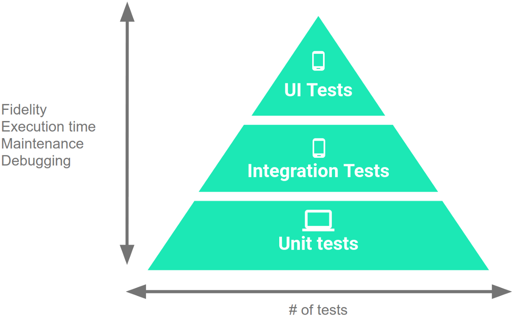
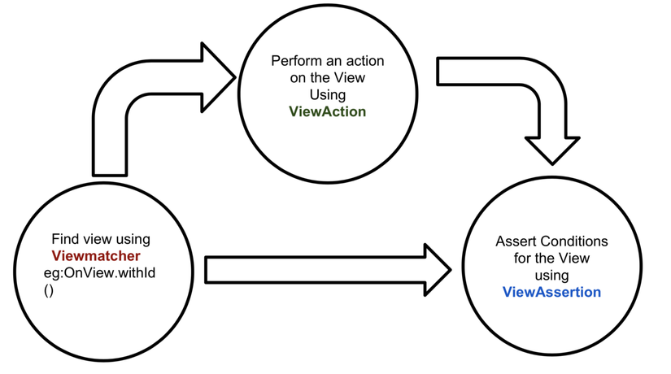

## Android UI Testing
---



### Why?
---

- Kiểm thử các thao tác người dùng với UI

### Framework?
---

1. Junit
    - Đơn giản
    - Nhanh

2. Mockito
    - >Mockito can be used as a mocking framework in Android. It allows us to fake external interactions
    - Để giả lập chức năng của các hàm trong interface, tạo giả một đối tượng cài đặt interface, giả lập lời gọi hàm đến đối tượng giả này và chỉ định kết quả trả lại cho lời gọi hàm giả lập đó

3. Robolectric
    - Viết và chạy test trên môi trường JVM mà không cần chạy ứng dụng Android trên device hoặc emulator -> tốc độ nhanh hơn rất nhiều so với Espresso khi có hàng trăm testcase
    - Hỗ trợ việc sử dụng các tài nguyên, có thế sử dụng findViewById() để tìm các view
    - > Shadow Classes, rewritten android core libraries by Robolectric, are the real magic of Robolectric. It is a replica of Android class with some exposed useful functions. Cool, isn’t it?

4. Espresso
    - Của google
    - Có thể test mọi thứ của UI, chạy trên thiết bị thực hoặc device
    - Flowchart

    

### Use?
---

1. Robolectric
    >Use
    - Tạo các view băng findViewById và test UI, perform click

    >Setup
    ```java
    testOptions {
        unitTests {
            includeAndroidResources = true
        }
    }
    testImplementation 'org.robolectric:robolectric:4.1'

    @RunWith(RobolectricTestRunner.class)
    ```
    >Code
    ```java
    public class RobolectricActivity extends Activity {

        @Override
        protected void onCreate(Bundle savedInstanceState) {
            super.onCreate(savedInstanceState);
            setContentView(R.layout.activity_main);
        }
    }
    ```

    ```xml
    <?xml version="1.0" encoding="utf-8"?>
    <LinearLayout xmlns:android="http://schemas.android.com/apk/res/android"
                xmlns:tools="http://schemas.android.com/tools"
                android:layout_width="match_parent"
                android:layout_height="match_parent"
                android:orientation="vertical"
                tools:context="com.vogella.android.robolectric.RobolectricActivity">
        <TextView
            android:id="@+id/hello_textview"
            android:layout_width="match_parent"
            android:layout_height="match_parent"
            android:text="Hello World!"
            android:gravity="center"
            android:layout_marginLeft="10dp"
            android:layout_marginRight="10dp"
            android:layout_marginTop="5dp"
            android:layout_marginBottom="5dp"
            android:background="@android:color/holo_green_dark"/>
    </LinearLayout>
    ```
    >Test
    ```java
    @RunWith(RobolectricTestRunner.class)
    public class RobolectricActivityTest {

        private RobolectricActivity activity;
        private TextView textView;

        @Before
        public void setUp() {
            activity = Robolectric.setupActivity(RobolectricActivity.class);
            textView = activity.findViewById(R.id.hello_textview);
        }

        @Test
        public void shouldNotBeNull() throws Exception
        {
            assertNotNull( activity );
        }

        @Test
        public void shouldHaveDefaultMargin() throws Exception {
            
            int bottomMargin = ((LinearLayout.LayoutParams) textView.getLayoutParams()).bottomMargin;
            assertEquals(5, bottomMargin);
            int topMargin = ((LinearLayout.LayoutParams) textView.getLayoutParams()).topMargin;
            assertEquals(5, topMargin);
            int rightMargin = ((LinearLayout.LayoutParams) textView.getLayoutParams()).rightMargin;
            assertEquals(10, rightMargin);
            int leftMargin = ((LinearLayout.LayoutParams) textView.getLayoutParams()).leftMargin;
            assertEquals(10, leftMargin);
        }
    }
    ```
    >See more
    https://www.vogella.com/tutorials/Robolectric/article.html
    http://myhexaville.com/2018/01/01/android-local-tests-robolectric/

2. Espresso
    >Use
    - ViewMatchers - find view
    - ViewActions - thực hiện các hành động trên các view
    - ViewAssertions - xác nhận trạng thái của view
    ```java
    onView(ViewMatcher)       
        .perform(ViewAction)     
            .check(ViewAssertion); 
    ```
    >Setup
    ```java
    androidTestImplementation 'com.android.support.test:rules:1.0.2'
    androidTestImplementation 'com.android.support.test:runner:1.0.2'
    androidTestImplementation 'com.android.support.test.espresso:espresso-core:3.0.2'

    android {
        testInstrumentationRunner "android.support.test.runner.AndroidJUnitRunner"
    }
    ```
    >Code
    ```java
    public class MainActivity extends Activity {

        EditText editText;

        @Override
        protected void onCreate(Bundle savedInstanceState) {
            super.onCreate(savedInstanceState);
            setContentView(R.layout.activity_main);

            editText =  findViewById(R.id.input_field);

            findViewById(R.id.button_text).setOnClickListener(() -> editText.setText("Lalala"))
        }
    }
    ```
    ```xml
    <LinearLayout xmlns:android="http://schemas.android.com/apk/res/android"
        xmlns:tools="http://schemas.android.com/tools"
        android:layout_width="match_parent"
        android:layout_height="match_parent"
        >

        <EditText
            android:id="@+id/input_field"
            android:layout_width="wrap_content"
            android:layout_height="wrap_content" />

        <Button
            android:id="@+id/button_text"
            android:layout_width="wrap_content"
            android:layout_height="wrap_content"
            android:text="New Button" android:onClick="onClick"/>
    </LinearLayout>
    ```
    >Test
    ```java
    @RunWith(AndroidJUnit4.class)
    public class MainActivityEspressoTest {


        @Rule
        public ActivityTestRule<MainActivity> mActivityRule =
            new ActivityTestRule<>(MainActivity.class);

        @Test
        public void ensureTextChangesWork() {
            // Type text and then press the button.
            onView(withId(R.id.inputField))
                    .perform(typeText("HELLO"), closeSoftKeyboard());
            onView(withId(R.id.changeText)).perform(click());

            // Check that the text was changed.
            onView(withId(R.id.inputField)).check(matches(withText("Lalala")));
        }
    }
    ```
    >See more
    https://www.vogella.com/tutorials/AndroidTestingEspresso/article.html


### Note
---
    
1. Setup môi trường test cho Dagger
    
    Cũng tương tự khi setup Dagger:

    ```kotlin
    @Singleton
    @Component(
        modules = [
            AndroidSupportInjectionModule::class,
            ActivityBuildersModuleTest::class,
            AppModule::class]
    )
    interface AppComponentTest : AndroidInjector<MyApplicationTest> {

        @Component.Builder
        abstract class Builder : AndroidInjector.Builder<MyApplicationTest>()
    }
    ```
    ```kotlin
    @Module
    abstract class ActivityBuildersModuleTest {
        @ContributesAndroidInjector
        abstract fun contributeMainActivity(): MainActivity
    }
    ```
    ```kotlin
    class MyApplicationTest : MyApplication() {
        override fun applicationInjector(): AndroidInjector<out DaggerApplication>? {
            return DaggerAppComponent.builder().create(this)
        }
    }
    ```
    ```kotlin
    @RunWith(RobolectricTestRunner::class)
    @Config(application = MyApplicationTest::class)
    class MainActivityTest {

        @Inject
        lateinit var activity: MainActivity

        @Before
        fun setUp() {
            activity = Robolectric.setupActivity(MainActivity::class.java)

        }

        @Test
        fun shouldNotBeNull() {
            assertNotNull(activity)
        }
    }
    ```

