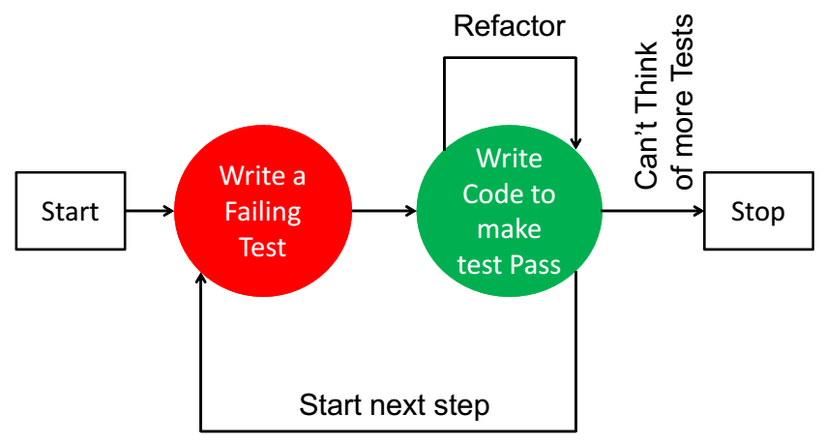
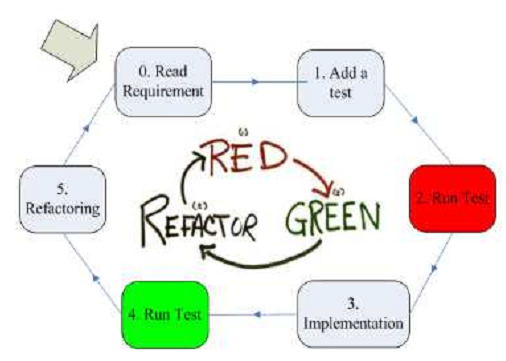
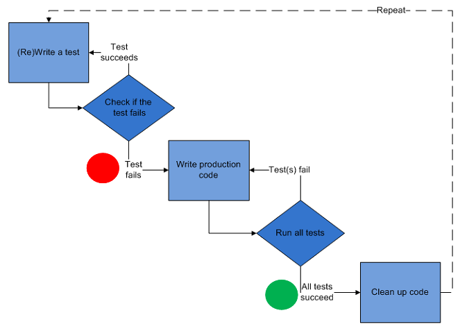

## Android Unit Testing
---


### Why?
---

- Unit Test dùng để xác định lại requirement và hỗ trợ cho detail design của chương trình
- Unit test không phải là tìm bug (bới lá tìm bọ) mà unit test là để nhằm hạn chế tối đa các bug khi xây dựng sản phẩm
 

### Rule?
---
1. Top to Down

2. Độc lập và không phụ thuộc vào các thành phần lập trình khác

3. Test Naming Convention


### FlowChart?
---







### Framework?
---

1. Junit
    - Đơn giản
    - Nhanh

2. Mockito
    - >Mockito can be used as a mocking framework in Android. It allows us to fake external interactions
    - Để giả lập chức năng của các hàm trong interface, tạo giả một đối tượng cài đặt interface, giả lập lời gọi hàm đến đối tượng giả này và chỉ định kết quả trả lại cho lời gọi hàm giả lập đó

3. PowerMock
    - Strong mock cùng với Mockito và Junit
    - Mock final, static, private method

### Demo?
---

1. Junit

    >Use
    - assertEquals(): assert 2 biểu thức bằng nhau
    - assertFalse(), assertTrue(): assert biểu thức false hoặc true
    - assertNotNull(), assertNull(): assert tham chiếu đối tượng khác null hoặc = null
    - assertNotSame(): So sánh địa chỉ vùng nhớ của 2 tham chiếu đối tượng bằng cách sử dụng toán tử ==. Test sẽ được chấp nhận nếu cả 2 đều tham chiếu đến các đối tượng khác nhau
    - assertThat(): so sánh every thing

    
    >Code
    ```java
    public String getFullName(String firstName, String lastName) {
        if(firstName == null || firstName.equal(""))
            return lastName;
        if(lastName == null || lastName.equal(""))
            return firstName;
        return firstName + lastName;
    }
    ```
    >Test
    ```java
    @Test
    public void getFullName_nullInput_returnNull() {
        assertNull(getFullName(null, null));
    }

    @Test
    public void getFullName_nullFirstName_returnLastName() {
        assertEqual(getFullName(null, "lastName"), "lastName");
    }

    @Test
    public void getFullName_nullLastName_returnFirstName() {
        assertThat(getFullName("firstName", null), is("firstName");
    }

    @Test
    public void getFullName_normalInput_returnFullName() {
        assertThat(getFullName("firstName", "lastName"), is("firstName lastName");
    }
    ```

    >See more

    https://www.vogella.com/tutorials/JUnit/article.html

2. Mockito
    >Use
    - @Mock: Tạo giả 1 đối tượng
    - @Spy: Bọc 1 đối tượng thực
    - @InjectMock: Inject các hàm khởi tạo, setter getter, thuộc tính cho chính class được InjectMock
    - ArgumentCaptor: 
    - verify(): xác thực 1 hàm có xảy ra không
    - ...
    
    >Setup
    ```java
    testImplementation 'org.mockito:mockito-core:2.24.5'
    ```
    ```java
    @Before
    public void setUp() {
        MockitoAnnotations.initMocks(this);
    }
    ```
    >Code
    
        Sử dụng List trong Java
    >Test
    ```java
    @Mock
    List<String> mockedList;
 
    @Test
    public void whenUseMockAnnotation_thenMockIsInjected() {
    mockedList.add("one");
        Mockito.verify(mockedList).add("one");
        assertEquals(0, mockedList.size());
    
        Mockito.when(mockedList.size()).thenReturn(100);
        assertEquals(100, mockedList.size());
    }
    ```
    >See more
    
    https://www.vogella.com/tutorials/Mockito/article.html
    https://www.baeldung.com/mockito-series

3. PowerMock
  
    >Setup
    ```java
    testImplementation 'org.powermock:powermock-api-mockito2:2.0.0'
    testImplementation 'org.powermock:powermock-core:2.0.0'
    testImplementation 'org.powermock:powermock-module-junit4:2.0.0'

    @RunWith(PowerMockRunner.class)
    @PrepareForTest(fullyQualifiedNames = "packagename.*")
    ```
    >Code
    ```java
    //Mock private method
    public class User {
        private String getGreeting() {
            return "Hello";
        }
    }
    ```
    ```java
    //Mock Contructor
    public class PowerMockConstructorExample {
 
        public String getMeSimpleObject() {
        SimpleClass simpleClass = new SimpleClass();
        
        String returnValue = simpleClass.getMeCurrentDateAsString();
            return returnValue;
        }
    }
    public class SimpleClass {
        public String getMeCurrentDateAsString() {
            return Calendar.getInstance().getTime().toGMTString();
        }
    }
    ```
    >Test
    ```java
    @Test
    public void testMockPrivateMethod() throws Exception {
        User spy = spy(new User());
        when(spy, method(User.class, "getGreeting")).withNoArguments().thenReturn("Good Morning");
        assertEquals("Good Morning", spy.getGreeting());
    }
    ```
    ```java
    @RunWith(PowerMockRunner.class)
    @PrepareForTest(PowerMockConstructorExample.class)
    public class PowerMockConstructorExampleTest {
    
    @Mock private SimpleClass mockSimpleClass;
    
    private PowerMockConstructorExample instance;
    
    @Test
    public void testMockConstructor() throws Exception {
        instance = new PowerMockConstructorExample();
        expectNew(SimpleClass.class).andReturn(mockSimpleClass);
    
        expect(mockSimpleClass.getMeCurrentDateAsString()).andReturn("Mock Result");
    
        replay(SimpleClass.class, mockSimpleClass);
        String value = instance.getMeSimpleObject();
        verify(SimpleClass.class, mockSimpleClass);
        assertEquals("Mock Result", value);
    }
    }
    ```

    >See more
    
    https://examples.javacodegeeks.com/core-java/powermockito/powermockito-tutorial-beginners/


### Note
---
-   Để sử dụng các thư viện, hàm trong Android khi test với Mockito hoặc Junit, thêm thư viện Robolectric và @RunWith(RobolectricTestRunner.class) (xem setup and example trong [ui testing](.ui-testing.md) )
