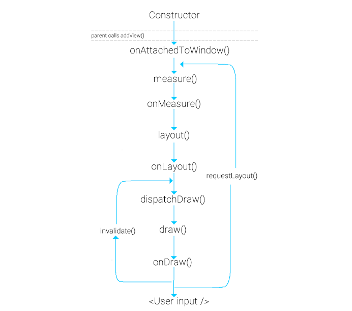

# 1. Custom View

    CustomView là tạo 1 class extend từ View, override onDraw() và sử dụng Pain và Canvas để vẽ trên View. Sâu i zì :V

TextView, Edittex, Checkbox,... Tất cả những thứ đó dù cha ông nó là gì đi nữa, thì cuối cùng vẫn là "đệ" của View. Ví dụ như EditText extends TextView rồi thì TextView extends View. Cũng như Activity, Fragment, Service,... Thì View cũng có vòng đời của nó. Tuy nhiên thì Google không có một tài liệu chính thống nào cho nó, mà hình ảnh dưới đây hoàn toàn là do kinh nghiêm ông cha ta đúc kết lại.
## 1.1. Lifecycle


### Constructor
1. View(Context context)constructor này sẽ được sử dụng khi mà chúng ta add view lúc code.
2. View(Context context, AttributeSet attrs) constructor này sẽ được sử dụng khi chúng ta khai báo view trong XML (file layout xml, attrs chứa các attribute truyền vào view trong xml).
3. View(Context context, AttributeSet attrs, int defStyleAttr) cũng dùng trong XML nhưng thêm 1 tham số đó là các thuộc tính style của theme mặc định.
4. View(Context context, AttributeSet attrs, int defStyleAttr, int defStyleRes) như cái 3 nhưng có thêm tham số để truyền style riêng thông qua resource.

Chúng ta để ý tới constructor 2. Chúng ta sẽ dùng AttributeSet để truyền các tham số, các giá trị khởi tạo ban đầu. Đầu tiên tạo file values/attrs.xml<br>

```xml
<ImageView
  android:layout_width="wrap_content"
  android:layout_height="wrap_content"
  android:src="@drawable/icon"/>
```

*Question?*
- Làm thế nào để thêm tham số vào contructor custom view?
- `layout_width`, `layout_height`, `src`nòi ở đâu ra?
- Mấy cái trên truyền qua View như thế nào?

>declare-styleable

    Chúng được nòi ra từ <declare-styleable> trong file attrs.xml
    Mỗi declare-styleable sẽ tạo ra 1 R.styleable.[tên] cộng với 1 R.styleable.[tên]_[thuộc tính] cho từng thuộc tính
    - R.styleable.[tên]: 1 array bao gồm tất cả các thuộc tính
    - R.styleable.[tên]_[thuộc tính]: 1 index trong array

```xml

<declare-styleable name="ImageView">
  <!-- Sets a drawable as the content of this ImageView. -->
  <attr name="src" format="reference|color" />
</declare-styleable>
```
>AttributeSet
```java
XmlPullParser parser = resources.getXml(myResource);
AttributeSet attributes = Xml.asAttributeSet(parser);
```

    XML -> View dưới dạng 1 AttributeSet - tập hợp các thuộc tính.
    Thường thì không truy cập biến này 1 cách trực tiếp, thay vào đó sẽ parsing nó qua Theme.obtainStyledAttributes() – convert  resource references (ví dụ  "@string/my_label") qua kiểu mong muốn - trả về 1 TypedArray để truy cập các thuộc tính. Nếu k thích thì sử dụng getAttributeResourceValue(int, int) để check thủ công sau đó tìm kiếm resource nếu cần


```java
public ImageView(Context context, AttributeSet attrs) {
  TypedArray ta = context.obtainStyledAttributes(attrs, R.styleable.ImageView, 0, 0);
  Drawable src = ta.getDrawable(R.styleable.ImageView_src);
  setImageDrawable(src);
  ta.recycle();
}
```
recycle() call khi đã xong việc với attribute. Lý do là để bỏ những rằng buộc không cần thiết đến với các dữ liệu không được sử dụng lại nữa 


```xml

<declare-styleable name="ImageView">
  <!-- Sets a drawable as the content of this ImageView. -->
  <attr name="src" format="reference|color" />
</declare-styleable>

<?xml version="1.0" encoding="utf-8"?>
<resources>
    <declare-styleable name="IndicatorView">
        <attr name="iv_color_selected" format="color"/>
        <attr name="iv_distance" format="dimension"/>
    </declare-styleable>
</resources>
```
`iv` là tiền tố phân biệt với các custom view hoặc thư viện khác

- Tên Custom view: `IndicatorView`
- Thuộc tính khoảng cách `iv_radius_distance` kiểu `dimension`
- Thuộc tính màu selected `iv_color_selected` kiểu `color`

1 số kiểu như:
- reference 
    
        tham chiếu tới id tài nguyên khác (e.g, "@color/my_color", "@layout/my_layout")
- color
- boolean
- dimension
- float
- integer
- string
- fraction
- enum
    ```xml
    <attr name="my_enum_attr">
        <enum name="value1" value="1" />
        <enum name="value2" value="2" />
    </attr>
    ```
- flag
    ```xml
    <attr name="my_flag_attr">
        <flag name="fuzzy" value="0x01" />
        <flag name="cold" value="0x02" />
    </attr>
    ```
Có thể set 2 kiểu cho thuộc tính như `format="reference|color"`

Trong class CustomView extend từ View với constructor có chứa tham số AttributeSet. Lấy các thuộc tính và giá trị như code dưới:
```kotlin
class IndicatorView : View {
    
    constructor(context: Context) : super(context)

    constructor(context: Context, attrs: AttributeSet) : super(context, attrs) {
        init(context, attrs)
    }

    private fun init(context: Context, attrs: AttributeSet) {
        val attribute = context.obtainStyledAttributes(attrs, R.styleable.IndicatorView)

        this.radiusUnselected =
            attribute.getDimensionPixelSize(R.styleable.IndicatorView_iv_radius_unselected, DEFAULT_RADIUS_UNSELECTED)

        this.distance = attribute.getInt(R.styleable.IndicatorView_iv_distance, DEFAULT_DISTANCE)

        this.colorSelected =
            attribute.getColor(R.styleable.IndicatorView_iv_color_selected, Color.parseColor("#ffffff"))

        attribute.recycle()
    }
}


```
`recycle()` call khi đã xong việc với attribute. Lý do là để bỏ những rằng buộc không cần thiết đến với các dữ liệu không được sử dụng lại nữa (Vì mục đích của ta chỉ cần lấy được các giá trị của attribute).

### OnAttachedToWindow
Sau khi parent view gọi addView(View) thì custom view sẽ được attach vào window. Ở giai đoạn này, custom view sẽ biết được vị trí các view ở xung quanh nó. Lúc này ta có thể findViewById được và lưu vào global reference (nếu cần).

### OnMeasure


giao diện có 2 thành phần chính đó là view cha (ViewGroup) và view con, các view con sẽ nằm trong view cha. Chúng ta có thể xác định kích thước của các view thông qua code Java là LayoutParams() hoặc trong XML là layout_width, layout_height. Để view cha có thể tính toán và sắp xếp các view con của nó một cách hòa thuận, thì cơ bản sẽ như thế này. Khi method onMeasure của view cha được thực hiện, view cha sẽ tìm và coi các thông số (width & height) của tất cả các view con và tính toán xem đứa con đó kích thước sẽ nên như thế nào dựa trên không gian khả dụng và thông số các view con đó yêu cầu muốn có. Sau đó nó sẽ thiết lập các liên kết, rồi chuyển thông tin kích cỡ và lời nhắn thông qua MeasureSpec đến các đứa con của mình (thông tin này sẽ được view con nhận tại method onMeasure của nó). Lời nhắn có thể sẽ mang những ý nghĩa như này AT_MOST: "Dù thế nào đi nữa thì con cũng chỉ cao 400dp mà thôi", hoặc EXACTLY: "Con nhất định phải cao 400dp", hoặc UNSPECIFIED: "Con muốn như thế nào thì tùy ý con"

```java
protected void onMeasure(int widthMeasureSpec, int heightMeasureSpec) {
      int widthMode = MeasureSpec.getMode(widthMeasureSpec);
      int widthSize = MeasureSpec.getSize(widthMeasureSpec);
      int heightMode = MeasureSpec.getMode(heightMeasureSpec);
      int heightSize = MeasureSpec.getSize(heightMeasureSpec);

      //desiredWidth: dựa vào nội dung muốn hiển thị mà bạn sẽ tính ra bạn cần tối thiểu bao nhiêu
      //không gian để bạn hiển thị
      ...
      int width;
      if (widthMode == MeasureSpec.EXACTLY) {
          width = widthSize;
      } else if (widthMode == MeasureSpec.AT_MOST) {
          width = Math.min(desiredWidth, widthSize);
      } else {
          width = desiredWidth;
      }
      ...
}
```
- `MeasureSpec.EXACTLY`: điều này nghĩa là chúng ta đã xác định cứng kích thước trong xml, như kiểu layout_width=300dp.
- `MeasureSpec.AT_MOST`: không nên vượt quá giới hạn này, vậy nên mới sử dụng câu lệnh Math.min(desiredWidth, widthSize).
- `MeasureSpec.UNSPECIFIED`: cho bạn thỏa sức, nhưng chúng ta chỉ cần những gì chúng ta thực sự cần mà thôi width = desiredWidth.

Sau khi view con tính toán xong việc nó cần kích thước như thế nào thì gọi đến method setMeasuredDimension để xác nhận, view cha sẽ nhận được thông tin đó và sẽ còn phải tính toán thêm vài lần nữa mới kết thúc, đoạn này chúng ta chưa cần quan tâm.

### onLayout
Tại phương thức này thì mọi chuyện đã xong, kích thước đã được set cho tất cả các view con, lúc này chúng ta dùng lệnh getWidth, getHeight thì mới có giá trị, chứ ở các method trước chưa tính toán xong thì chỉ có = 0 mà thui.

### onDraw
sử dụng Canvas và Paint object để vẽ. Canvas instance được nằm trong parameter của onDraw, nó đơn giản là để vẽ các hình khác nhau, còn Paint object sẽ chỉ định màu sắc (chung hơn là style) của hình đó. Nó được sử dụng hầu như mọi nơi đễ vẽ bất kì một đường thằng, hình vuông, tròn hay bất cứ hình gì…<br>
Khi vẽ custom view, ta cần ghi nhớ một điều rằng onDraw sẽ được gọi rất nhiều lần. Khi có bất kì sự thay đổi nào, khi ta vuốt hay kéo ngang màn hình … view sẽ được vẽ lại. Chính vì vậy mà Android Studio khuyên rằng nên tránh khai báo khởi tạo Object trong method này mà thay vào đó nên tạo mới ở chỗ khác và gọi sử dụng nó.

### ViewUpdate 
Nhìn vào View lifecycle sẽ thấy 2 method được sử dụng để tự nó thực hiện việc vẽ lại: `invalidate()` và `requestLayout()` giúp bạn tương tác qua lại với custom view, bạn hoàn toàn có thể thay đổi view khi đang runtime. Nhưng tại sạo lại có tận 2 method ?

- `invalidate()` sử dụng được vẽ lại các view đơn giản. Ví dụ khi bạn update lại text, color hay tương tác chạm điểm. Có nghĩa là view chỉ cần đơn giản gọi onDraw() để update lại trạng thái của view.
- `requestLayout()` như bạn thấy trong sơ đồ lifecycle thì method này sẽ gọi lại view update từ onMeasure(). Điều đó có nghĩa là việc thực hiện vẽ lại view sẽ được tính toán lại kích thước. Kích thước mới có thể được tính lại ở onMeasure vẽ sẽ thực hiện vẽ theo kích thước mới đó.

### Touching
Để handle các sự kiện chạm , kéo vào màn hình, override `onTouchEvent()`

## 1.2. Optimize performance
- *Invalidate intelligently*: không gọi `invalidate()` cho đến khi 1 cái gì đó hiển thị cho user thay đổi. Nếu có thể nên pass 1 đối tượng vẽ vào `invalidate()` để nói với GPU phần nào của màn hình được vẽ
- *Draw carefully*: không vẽ những thứ mà người dùng không nhìn thấy. Màn hình là một bề mặt 2D và sẽ vô dụng khi vẽ một thứ mà sau đó bị chồng chéo bởi một thứ khác, use `Canvas.clipRect()`. Không vẽ một cái gì đó nằm ngoài giới hạn màn hình, use `canvas.quickReject()`
- *Never allocate objects in onDraw*: onDraw() được gọi 60 lần/s, mặc dù bộ thu gom rác(garbage collectors) rất nhanh nhưng nó chạy trên 1 luồng riêng nên ăn rất nhiều pin. Tóm lại là không khởi tạo object trong onDraw 

# 1.3 Thing
Mình là 1 Big Fan của câu ngạn ngữ thần thành *Không đi làm lại cái bánh xe mà người khác đã làm rồi*.

Vậy lên theo mình thì với các View Custom basic thì chúng ta lên 
sử dụng thư viện cho nhanh với điều kiện các thư viện này được maintain dễ custom. Với các TH có yêu cầu design thì tất nhiên rồi, quất thôi tuy có mất nhiều time. Còn với 1 số TH như Toolbar, Loading View, Swip Refersh, NoDataScreen ... của riêng app thì nên custom vì nó khá đơn giản không phải vẽ view nhiều, dễ dàng dùng và sửa đổi về sau.

Nguồn: [1](https://viblo.asia/p/android-custom-view-924lJr6zlPM)
[2](https://kipalog.com/posts/Android--Hieu-sau-hon-ve-CustomView-va-Huong-dan-xay-dung-thu-vien-UI-IndicatorView)
[3](https://medium.com/dualcores-studio/make-an-android-custom-view-publish-and-open-source-99a3d86df228#.oqx0a0tiq)
[4](https://medium.com/@douglas.iacovelli/the-beauty-of-custom-views-and-how-to-do-it-79c7d78e2088)
[5](https://academy.realm.io/posts/360andev-huyen-tue-dao-measure-layout-draw-repeat-custom-views-and-viewgroups-android/)
[6](https://medium.com/mindorks/how-to-create-custom-views-141dc0570e57)
[7](https://proandroiddev.com/building-a-custom-view-a-practical-example-2753cb9d0e80)

# 2. Constraint Layout
Để hiểu nhanh nhất về Constraint Layout thì ta sẽ so sánh nó với Relative Layout và Linear Layout

## 2.1. Vị trí tương đối
Việc sắp xếp các View con bên trong ConstraintLayout sẽ dựa vào các ràng buộc (constraint), tức là View này ràng buộc vào View kia mà sắp xếp. Nghĩ một chút thì cũng có vẻ giống giống RelativeLayout khi các View con sẽ được sắp xếp dựa theo vị trí tương đối so với các View khác. Tuy nhiên, ConstraintLayout còn làm được nhiều hơn thế. 
- Căn cho 2 cạnh bên cùng một phía của 2 View được thẳng hàng với nhau

```kotlin
    //RelativeLayout
    android:layout_alignStart="@id/view"
    android:layout_alignLeft="@id/view"
    android:layout_alignEnd="@id/view"
    android:layout_alignRight="@id/view"
    android:layout_alignTop="@id/view"
    android:layout_alignBaseline="@id/view"
    android:layout_alignBottom="@id/view"

    //ConstraintLayout
    app:layout_constraintStart_toStartOf="@id/view"
    app:layout_constraintLeft_toLeftOf="@id/view"
    app:layout_constraintEnd_toEndOf="@id/view"
    app:layout_constraintRight_toRightOf="@id/view"
    app:layout_constraintTop_toTopOf="@id/view"
    app:layout_constraintBaseline_toBaselineOf="@id/view"
    app:layout_constraintBottom_toBottomOf="@id/view"
```
- 2 View được sắp xếp bên cạnh nhau
```kotlin
    //RelativeLayout
    android:layout_toStartOf="@id/view"
    android:layout_toLeftOf="@id/view"
    android:layout_toEndOf="@id/view"
    android:layout_toRightOf="@id/view"
    android:layout_above="@id/view"
    android:layout_below="@id/view"

    //ConstraintLayout
    app:layout_constraintStart_toEndOf="@id/view"
    app:layout_constraintLeft_toRightOf="@id/view"
    app:layout_constraintEnd_toStartOf="@id/view"
    app:layout_constraintRight_toLeftOf="@id/view"
    app:layout_constraintTop_toBottomOf="@id/view"
    app:layout_constraintBottom_toTopOf="@id/view"
```
- Neo các View vào các cạnh trên, dưới, trái hoặc phải của ViewGroup cha

```kotlin
    //RelativeLayout
    android:layout_alignParentStart="true"
    android:layout_alignParentLeft="true"
    android:layout_alignParentEnd="true"
    android:layout_alignParentRight="true"
    android:layout_alignParentTop="true"
    android:layout_alignParentBottom="true"

    //ConstraintLayout
    app:layout_constraintStart_toStartOf="parent"
    app:layout_constraintLeft_toLeftOf="parent"
    app:layout_constraintEnd_toEndOf="parent"
    app:layout_constraintRight_toRightOf="parent"
    app:layout_constraintTop_toTopOf="parent"
    app:layout_constraintBottom_toBottomOf="parent"
```
- để các View được căn vào giữa của 2 cạnh nào đó, ta chỉ cần neo 2 cạnh (hoặc 4 cạnh) của View đó vào 2 cạnh (hoặc 4 cạnh) là được

```kotlin
<TextView
    style="@style/TextAppearance.AppCompat.Large"
    android:layout_width="wrap_content"
    android:layout_height="wrap_content"
    android:text="hello world"
    app:layout_constraintBottom_toBottomOf="parent"
    app:layout_constraintEnd_toEndOf="parent"
    app:layout_constraintStart_toStartOf="parent"
    app:layout_constraintTop_toTopOf="parent"/>

    //thằng cu trên cũng na ná với layout_centerInParent, layout_centerHorizontal và layout_centerVertical của RelativeLayout
```


- khi neo 2 cạnh đối diện của một view vào cùng một điểm neo, view đó sẽ được căn vào chính giữa của điểm neo đó


- Thế nếu bạn không muốn nó vào giữa, mà là nằm ở vị trí 30% hoặc 70% chiều rộng của ViewGroup cha thì sao. RelativeLayout thì làm thế nào được ~~. Thế mà, ConstraintLayout lại cung cấp một thuộc tính cho phép đạt được điều này: bias - có thể hiểu là bạn muốn sắp xếp View này thiên về bên nào hơn. Giá trị của bias nằm trong khoảng từ 0 đến 1 và có kiểu Float. Thuộc tính này chỉ có tác dụng khi View đang neo 2 cạnh đối diện hoặc cả 4 cạnh. ConstraintLayout cung cấp thuộc tính này cho cả chiều ngang (horizontal) và chiều dọc (vertical). Và nếu khi đã neo 2 cạnh hoặc 4 cạnh, nếu không có giá trị bias nào được chỉ định, bias sẽ có giá trị mặc định là 0.5, tức là vào giữa của 2 hoặc 4 điểm neo

```kotlin
<TextView
    style="@style/TextAppearance.AppCompat.Large"
    android:layout_width="wrap_content"
    android:layout_height="wrap_content"
    android:text="hello world"
    app:layout_constraintBottom_toBottomOf="parent"
    app:layout_constraintEnd_toEndOf="parent"
    app:layout_constraintHorizontal_bias="0.3"
    app:layout_constraintStart_toStartOf="parent"
    app:layout_constraintTop_toTopOf="parent"
    app:layout_constraintVertical_bias="0.7"/>
```


-  Giá trị `match_parent` khi xác định width và height của một View sẽ không còn được hỗ trợ với ConstraintLayout nữa. Thay vào đó, ConstraintLayout giới thiệu một giá trị khác: `match_constraint` cũng có mục đích tương tự với match_parent. Ta sẽ sử dụng `match_constraint` bằng cách set `layout_width` hoặc `layout_height` bằng `0dp` và neo 2 cạnh đối diện của View vào 2 bên tương ứng để width/ height của View tràn ra và đạt được hiệu ứng như match_parent.

## 2.2. Tỷ lệ giữa width và height (constraint dimension ratio)
- Để tạo 1 Button với width = height hoặc bằng 2 lần heignt thì ngoài set cứng dp thì how to làm :v Trong constraint layout thì `layout_constraintDimensionRatio` dễ như ăn bánh


- Để sử dụng thuộc tính này, giá trị của layout_width hoặc layout_height hoặc cả 2 phải là match_constraint. Trong trường hợp cả 2 thuộc tính đều là match_constraint, Android sẽ lấy giá trị lớn nhất của width hoặc height thỏa mãn được việc sắp xếp trong ViewGroup cha mà vẫn giữ được tỷ lệ giữa width và height đã khai báo.


- Ngoài ra, với ratio chúng ta cũng có thể xác định rõ xem width phải ràng buộc theo height hay height phải ràng buộc theo width bằng cách thêm W hoặc H vào trước tỷ lệ.


Trong trường hợp ở trên, width ở đây phải ràng buộc theo height. Tuy nhiên, vì width đã được set một giá trị cố định là 90dp nên Android sẽ dãn height ra để tỷ lệ 4:3 vẫn được thỏa mãn
## 2.3. Chuỗi (Chain)

Cơ chế của LinearLayout cho phép chúng ta có thể sắp xếp các View lần lượt cạnh nhau từ trái sang phải hoặc từ trên xuống dưới. Trong ConstraintLayout, ta cũng có thể làm điều này bằng cách liên kết các View đó thành một nhóm thông qua việc sử dụng chain.

Để tạo một chain, ta cần kết nối các View với nhau theo cả 2 hướng (bi-directional connection) và phải là từ 2 hướng. 2 hướng ở đây có nghĩa là ví dụ đuôi của view 1 neo vào đầu của view 2 và đầu của view 2 cũng cần được neo vào đuôi của view 1. Nếu kết nối chỉ có từ 1 phía, Android sẽ không thể nhận ra được các View đó nằm trong cùng một chain


Style của chain:

**1. Spread**: Các View sẽ được phân bố một cách đều nhau và đây là style mặc định của một chain.
`layout_constraintHorizontal_chainStyle="spread"`
`layout_constraintVertical_chainStyle="spread"`

**2. Spread inside**: 2 phần tử đầu tiên và cuối cùng sẽ được neo vào 2 điểm ràng buộc ở đầu và cuối của chain, các phần tử ở giữa còn lại được phân bố một cách đều nhau như với style spread.
`layout_constraintHorizontal_chainStyle="spread_inside"`
`layout_constraintVertical_chainStyle="spread_inside"`

**3. Weighted**: Khi style của chain được set là spread hoặc spread inside, các khoảng trống giữa các View sẽ có thể được chiếm bởi chính các View đó. Để làm được điều này, ta cần set `layout_width` hoặc `layout_height` của view muốn chiếm chỗ là match_constraint. Ngoài ra, khi các View đều đã chiếm hết các khoảng trống, ta có thể xác định xem View nào chiếm nhiều phần hơn View nào bằng cách sử dụng thuộc tính `layout_constraintHorizontal_weight` hoặc `layout_constraintVertical_weight`. Các thuộc tính này hoạt động giống với layout_weight trong LinearLayout: weight lớn hơn thì chiếm nhiều phần hơn, weight bằng nhau thì chiếm phần bằng nhau.

Nếu một phần tử C trong chuỗi match_constraint nhưng lại không được set weight và các phần tử còn lại đều được set weight hoặc wrap_content, phần tử C đó sẽ không được hiển thị lên.


**4. Packed**: Các View trong chain sẽ được "bó" vào nhau. Với style này, bạn có thể xác định bias cho cả chain bằng cách thay đổi giá trị bias ở phần tử head chain
`layout_constraintHorizontal_chainStyle="packed"`
`layout_constraintVertical_chainStyle="packed"`


Và với packed chain có bias bằng 0.2
`layout_constraintHorizontal_bias="0.2"`


## 2.4. Margin
Trong ConstraintLayout, margin sẽ chỉ có tác dụng trong trường hợp View đã được neo vào đúng hướng với hướng muốn margin. Một điểm khác nữa với margin trong ConstraintLayout là *margin_ không được là số âm.

Khi một view được GONE đi, mọi giá trị size của View đều sẽ bằng 0dp nhưng vẫn sẽ tham gia vào quá trình tính toán các ràng buộc. Cùng với đó, tất cả các margin đối với những ràng buộc của View này cũng sẽ được set bằng 0dp. Trong trường hợp đó, layout sẽ ngay lập tức bị phá vỡ. Bởi vậy, ConstraintLayout đã cung cấp thêm một số thuộc tính mới dành cho margin để xác định margin trong trường hợp View được lấy làm mỏ để neo biến mất - visibility="GONE". Lưu ý: giá trị margin này sẽ chỉ có tác dụng trong trường hợp View làm mỏ neo bị biến mất: `layout_goneMarginStart`

```kotlin
<Button
    android:id="@+id/btn_visible"
    android:layout_width="72dp"
    android:layout_height="32dp"
    android:visibility="gone"
    android:layout_marginStart="16dp"
    android:background="@color/colorAccent"
    app:layout_constraintStart_toStartOf="parent"/>

<Button
    android:id="@+id/btn_delete"
    android:layout_width="72dp"
    android:layout_height="32dp"
    android:layout_marginStart="8dp"
    android:background="@color/colorAccent"
    app:layout_constraintStart_toEndOf="@id/btn_visible"
    app:layout_goneMarginStart="98dp"/>
```


## 2.4. Guideline

Android cũng cung cấp thêm một Widget mới là Guideline (có dạng như một đường thẳng) đóng vai trò như một điểm để neo các View khác vào. Vì chỉ nhằm mục đích thiết kế, Guideline sẽ chỉ hiển thị trên bản thiết kế (blueprint) hoặc preview editor chứ không hiển thị khi chạy ứng dụng

```kotlin
<android.support.constraint.Guideline
    android:id="@+id/guideline1"
    android:layout_width="wrap_content"
    android:layout_height="wrap_content"
    android:orientation="vertical"
    app:layout_constraintGuide_begin="80dp"/>

<android.support.constraint.Guideline
    android:id="@+id/guideline2"
    android:layout_width="wrap_content"
    android:layout_height="wrap_content"
    android:orientation="horizontal"
    app:layout_constraintGuide_percent="0.5"/>
```


Guideline chỉ có 2 thuộc tính bạn cần chú ý đến: một là hướng của Guideline: `horizontal` hay `vertical`. Thứ hai là vị trí của Guideline trên bản thiết kế: ở một vị trí xác định `layout_constraintGuide_begin` hoặc ở một vị trí tương đối `layout_constraintGuide_percent`. Vì đây chỉ là một Widget có tác dụng hỗ trợ việc thiết kế chứ không được hiển thị lên, bạn sẽ không thể neo được Guideline vào đâu cả.


