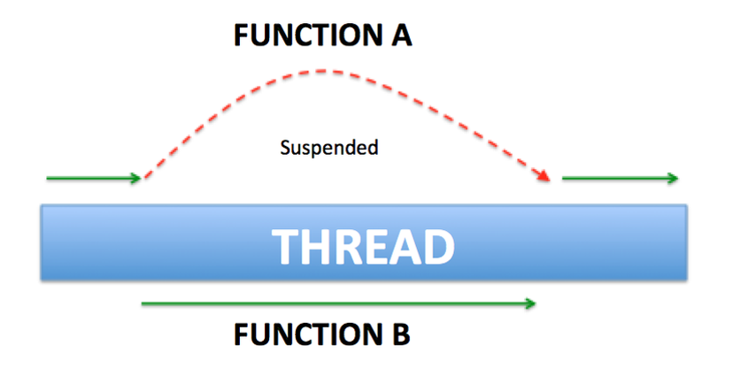

# COROUTINES

## Example

    Một usecase đơn giản để hiểu coroutines là gì?
    1. Lấy User từ server 
    2. Show User lên UI
```kotlin
fun fetchUser(): User {
    // make network call
    // return user
}

fun showUser(user: User) {
    // show user
}
```
>Callback:
```kotlin
fun fetchAndShowUser() {
    fetchUser { user ->
        showUser(user)
    }
}
```
>RxJava:
```kotlin
fetchUser()
        .subscribeOn(Schedulers.io())
        .observerOn(AndroidSchedulers.mainThread())
        .subscribe { user ->
            showUser(user)
        }
```
>And Coroutines: yes, coroutines
```kotlin
suspend fun fetchAndShowUser() {
     val user = fetchUser() // fetch on IO thread
     showUser(user) // back on UI thread
}
```
*Không đồng bộ lại đồng bộ mà lại không đồng bộ -_-*

## Coroutines là gì?
>One can think of a coroutine as a light-weight thread. Like threads, coroutines can run in parallel, wait for each other and communicate. The biggest difference is that coroutines are very cheap, almost free: we can create thousands of them, and pay very little in terms of performance. True threads, on the other hand, are expensive to start and keep around. A thousand threads can be a serious challenge for a modern machine.

    Coroutines về cơ bản có thể hiểu nó như một "light-weight" thread, nhưng nó không phải là 1 thread, chúng chỉ hoạt động tương tự 1 thread :v . Một sự khác biệt quan trọng là sự giới hạn : Thread rất hạn chế vì ta biết đến Thread Pool, nó sẽ hạn chế số lượng Thread ở 1 thời điểm,còn coroutines thì gần như là hàng free, hàng nghìn coroutines có thể được bắt đầu cùng một lúc. Chúng cho phép chạy một đoạn mã không đồng bộ theo cách tương tự một mã đồng bộ

**Long running tasks**

    Ứng dụng hiển thị tới user liên tục, main thread sẽ update screen với 16 millisecond mỗi giây hoặc thường xuyên hơn sẽ tương đương khoảng 60 fps. Sẽ có rất nhiều các tác vụ chiếm nhiều thời gian xử lý như là parsing một datasets JSON lớn, ghi data vào database hoặc fetching data từ network. Vì vậy, xử lý chúng trên main thread sẽ có thể gây ra treo ứng dụng, giật lag, hoặc freeze rồi dẫn tới ANR
 
Để thực hiện được long running task có thể dùng tới callback, rxJava, nhưng cũng có 1 số nhược điểm với mỗi cái
- Callback: quá nhiều callback, code sẽ trở nên phức tạp và khó đọc hiểu hơn, không cho phép sử dụng với 1 số feature của ngôn ngữ như Exceptions

- RxJava: Khó tiếp cận với newbie, số lượng internal objects được gen ra lớn khiến perfomence giảm 1 xíu

Thôi thì quất luôn coroutines vì nó rất nhẹ, và được tích hợp sẵn trong kotlin,...

## Implementation
```kotlin
dependencies {
  implementation "org.jetbrains.kotlinx:kotlinx-coroutines-core:x.x.x"
  implementation "org.jetbrains.kotlinx:kotlinx-coroutines-android:x.x.x"
}
```

### Suspend function
    
    là function có thể dừng việc thực hiện khi chúng được gọi và làm cho nó tiếp tục khi nó đã chạy xong nhiệm vụ của riêng chúng, có thể chạy trên background thread hoặc main thread.



```kotlin
suspend fun fetchAndShowUser() {
    val user = fetchUser() // fetch on IO thread
    showUser(user) // back on UI thread
}
```

### Dispatchers

    Quyết định thread nào sẽ thực hiện công việc
    - IO: Network, disk related work
    - Default: CPU
    - Main: UI thread

```kotlin
suspend fun fetchUser(): User {
    return GlobalScope.async(Dispatchers.IO) {
        // make network call
        // return user
    }.await()
}
```

### Coroutines Builder
- `launch{}`: tạo ra một coroutine mới và trả về một tham chiếu đến nó như một đối tượng Job mà không có kết quả trả về. 
    ```kotlin
    fun fetchUserAndSaveInDatabase() {
        // fetch user from network
        // save user in database
        // and do not return anything
    }

    GlobalScope.launch(Dispatchers.IO) {
    fetchUserAndSaveInDatabase() // do on IO thread
}
    ```
- `async{}`: Tạo ra một coroutine mới và trả về một tham chiếu đến nó như là một Deferred<T> có thể có kết quả, sử dụng cùng với .await() chờ đợi cho một kết quả mà không gây block thread
    ```kotlin
    fun fetchFirstUser(): User {
        // make network call
        // return user
    }

    fun fetchSeconeUser(): User {
        // make network call
        // return user
    }

    GlobalScope.launch(Dispatchers.Main) {
        val userOne = async(Dispatchers.IO) { fetchFirstUser() }
        val userTwo = async(Dispatchers.IO) { fetchSeconeUser() }
        showUsers(userOne.await(), userTwo.await()) // back on UI thread
    }
    ```
- runBlocking: Block thread hiện tại cho đến khi coroutine thực hiện.

### `withContext()`
    Ngay lập tức áp dụng bộ dispatcher từ context mới, chuyển việc thực thi trong block sang một luồng khác và sau khi hoàn hành sẽ trở lại luồng hiện tại, không cần dùng await()
```kotlin
suspend fun fetchUser(): User {
    return GlobalScope.async(Dispatchers.IO) {
        // make network call
        // return user
    }.await()
}

suspend fun fetchUser(): User {
    return withContext(Dispatchers.IO) {
        // make network call
        // return user
    }
}
```

### Scopes
    Hữu dụng khi cancel background task
- Với activity: CoroutineScope
```kotlin
class MainActivity : AppCompatActivity(), CoroutineScope {

    override val coroutineContext: CoroutineContext
        get() = Dispatchers.Main + job

    private lateinit var job: Job

}

override fun onCreate(savedInstanceState: Bundle?) {
    super.onCreate(savedInstanceState)
    job = Job() // create the Job
}

override fun onDestroy() {
    job.cancel() // cancel the Job
    super.onDestroy()
}

launch {
    val userOne = async(Dispatchers.IO) { fetchFirstUser() }
    val userTwo = async(Dispatchers.IO) { fetchSeconeUser() }
    showUsers(userOne.await(), userTwo.await())
}
```

- Với application: GlobalScope
```kotlin
GlobalScope.launch(Dispatchers.Main) {
    val userOne = async(Dispatchers.IO) { fetchFirstUser() }
    val userTwo = async(Dispatchers.IO) { fetchSeconeUser() }
}
```
### Exception
- Với `launch`:
    ```kotlin
    val handler = CoroutineExceptionHandler { _, exception ->
        Log.d(TAG, "$exception handled !")
    }

    GlobalScope.launch(Dispatchers.IO + handler) {
        fetchUserAndSaveInDatabase() // do on IO thread
    }
    ```
- Với `async`:  sử dụng try catch
    ```kotlin
    val deferredUser = GlobalScope.async {
        fetchUser()
    }
    try {
        val user = deferredUser.await()
    } catch (exception: Exception) {
        Log.d(TAG, "$exception handled !")
    }
    ```

## Coroutines with Retrofit
>Instance adapter retrofit
```kotlin
private fun makeService(okHttpClient: OkHttpClient): MyService {
    val retrofit = Retrofit.Builder()
            .baseUrl("some_api")
            .client(okHttpClient)            .addCallAdapterFactory(CoroutineCallAdapterFactory()).build()
    return retrofit.create(MyService::class.java)}

```
>Interface API
```kotlin
interface RetrofitService {
    @GET("some_endpoint")
    fun getData(): Deferred<List<MyData>>
```
Deferred chỉ đơn giản là trả về một đối tượng của loại đặc biệt, thường được sử dụng với await để tạm dừng để chờ đợi cho nó thực hiện xong mà không gây block main Thread.

>Lấy data -> mapping data hiển thị lên UI
- Với RxJava: 
    ```kotlin
    override fun getData(): Observable<List<MyData>> {    
        return myService.getData()           
            .map { result -> result.map {myDataMapper.mapFromRemote(it) }}
    }
    ```
- Với Coroutines
    ```kotlin
    override suspend fun getData(): List<MyData> {    
        val result = myService.getData().await()    
        return result.map { myDataMapper.mapFromRemote(it) }\
    }
    ```
>Use
```kotlin
private var myJob: Job? = null
myJob = CoroutineScope(Dispatchers.IO).launch {
    val result = repo.getData()
    withContext(Dispatchers.Main) {
        //do something with result
    }
}
override fun onDestroy() {
    myJob?.cancel()
    super.onDestroy()
}
```